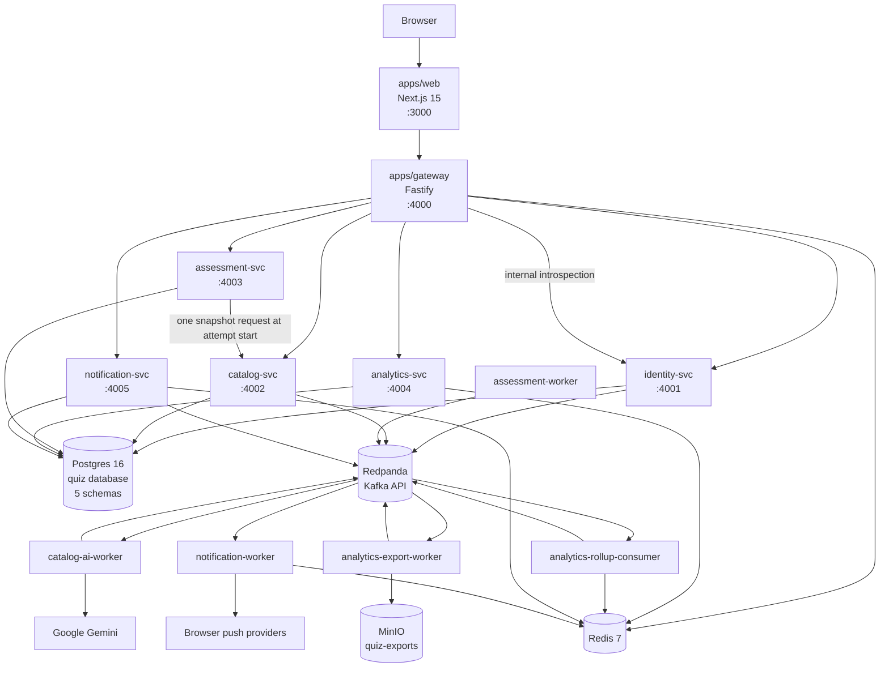
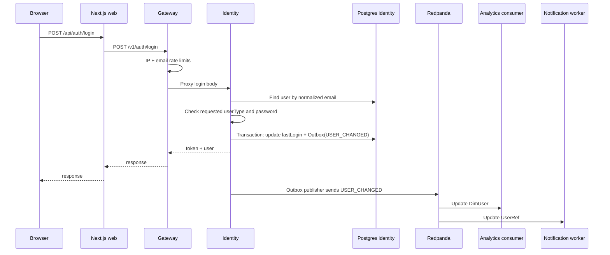
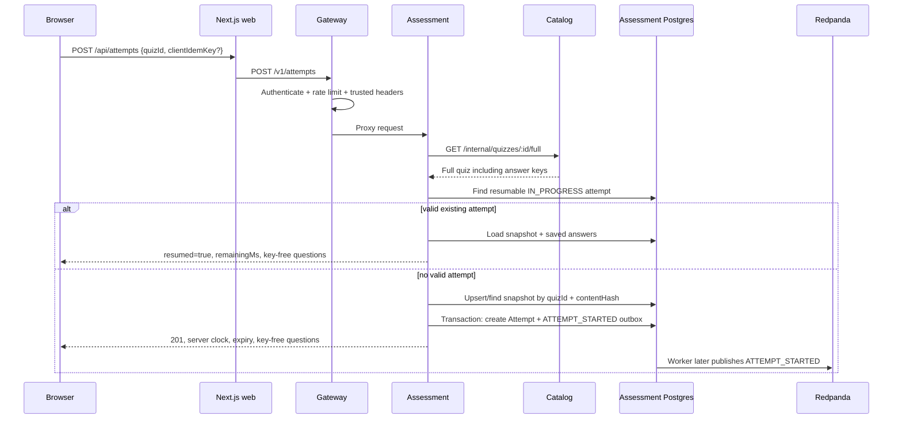
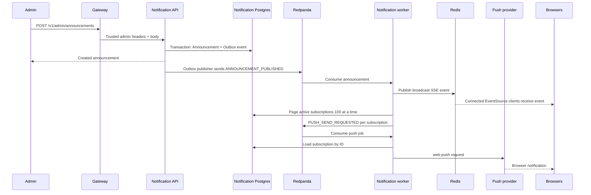

# Quiz Platform — Current Architecture

> **Purpose:** this document describes the architecture implemented in the current working tree after the service split. It is the operational reference for understanding data flow, service boundaries, requests, events, storage, workers, and safe change procedures.
>
> `ARCHITECTURE.md` contains valuable rationale and migration history, but parts of it describe the pre-split monolith or planned work. For current behavior, use this file and the code. Where documentation and code disagree, the code wins.

---

## Contents

1. [The system in one sentence](#1-the-system-in-one-sentence)
2. [Runtime topology](#2-runtime-topology)
3. [Core architectural rules](#3-core-architectural-rules)
4. [How an HTTP request flows](#4-how-an-http-request-flows)
5. [Gateway routing, authentication, and rate limiting](#5-gateway-routing-authentication-and-rate-limiting)
6. [Complete backend request inventory](#6-complete-backend-request-inventory)
7. [Service-by-service architecture](#7-service-by-service-architecture)
8. [Shared packages and common service behavior](#8-shared-packages-and-common-service-behavior)
9. [Postgres ownership and Prisma](#9-postgres-ownership-and-prisma)
10. [Kafka and event-driven flows](#10-kafka-and-event-driven-flows)
11. [Redis responsibilities](#11-redis-responsibilities)
12. [End-to-end flow: signup and login](#12-end-to-end-flow-signup-and-login)
13. [End-to-end flow: taking and submitting a quiz](#13-end-to-end-flow-taking-and-submitting-a-quiz)
14. [End-to-end flow: analytics and leaderboards](#14-end-to-end-flow-analytics-and-leaderboards)
15. [End-to-end flow: AI quiz generation](#15-end-to-end-flow-ai-quiz-generation)
16. [End-to-end flow: CSV export](#16-end-to-end-flow-csv-export)
17. [End-to-end flow: announcements, SSE, and push](#17-end-to-end-flow-announcements-sse-and-push)
18. [How to make changes correctly](#18-how-to-make-changes-correctly)
19. [Verification and debugging](#19-verification-and-debugging)
20. [Known gaps and intentional limitations](#20-known-gaps-and-intentional-limitations)
21. [Quick location reference](#21-quick-location-reference)

---

## 1. The system in one sentence

The browser talks only to the Next.js web application; the web application's API route handlers forward requests only to the Fastify gateway; the gateway authenticates once, rate-limits, removes untrusted identity headers, and proxies to one owning service; services own separate Postgres schemas and exchange derived state through Kafka events, Redis, and a small number of internal-only HTTP calls.

The key consequence is ownership:

- identity owns users and token validation;
- catalog owns quiz content and answer keys;
- assessment owns live attempts, frozen quiz snapshots, answers, timers, and scoring;
- analytics owns derived read models and leaderboards, never authoritative attempt data;
- notification owns announcements, subscriptions, SSE connections, and push delivery;
- the gateway owns public backend routing, authentication termination, and rate limiting;
- the web app owns presentation and thin server-side request forwarding, not database access.

---

## 2. Runtime topology

### 2.1 High-level diagram



### 2.2 Application processes

| Directory | Package | Port | Processes | Authoritative responsibility |
|---|---|---:|---|---|
| `apps/web` | `web` | 3000 | Next.js server | UI, pages, thin `/api/**` forwarders |
| `apps/gateway` | `gateway` | 4000 | Fastify gateway | Authentication termination, header scrubbing, rate limits, proxy routing |
| `apps/identity` | `identity-svc` | 4001 | API; outbox publisher runs in-process | Users, passwords, opaque-token introspection |
| `apps/catalog` | `catalog-svc` | 4002 | API + `catalog-ai-worker` | Subjects, chapters, quizzes, question bank, answer keys, AI jobs |
| `apps/assessment` | `assessment-svc` | 4003 | API + `assessment-worker` | Attempts, snapshots, autosave, timers, server scoring |
| `apps/analytics` | `analytics-svc` | 4004 | API + rollup consumer + export worker | Derived projections, analytics reads, leaderboards, exports |
| `apps/notification` | `notification-svc` | 4005 | API + notification worker | Announcements, reads, push subscriptions, SSE, push fanout |

There are twelve application processes when every API, worker, and the web server are running.

### 2.3 Infrastructure

| Component | Image | Host port | In-Compose address | Purpose |
|---|---|---:|---|---|
| Postgres | `postgres:16-alpine` | 5433 | `postgres:5432` | One `quiz` database with five isolated schemas |
| Redis | `redis:7-alpine` | 6380 | `redis:6379` | Token cache, rate limits, leaderboards, analytics cache, SSE |
| Redpanda | `redpandadata/redpanda:v24.2.18` | 19092 | `redpanda:9092` | Kafka-compatible event transport |
| Redpanda Console | `redpandadata/console:v2.7.2` | 8090 | — | Topic, record, and consumer-lag inspection |
| MinIO API | `minio/minio` | 9000 | `minio:9000` | S3-compatible CSV storage |
| MinIO Console | `minio/minio` | 9001 | — | Export-object inspection |
| Caddy | `caddy:2-alpine` | 80/443 in production | `caddy` | TLS and gateway reverse proxy in the production overlay |

Host ports 5433 and 6380 deliberately avoid collisions with locally installed Postgres and Redis-compatible services.

### 2.4 Source and runtime choices

- Package manager: pnpm 10.12.3.
- Node.js: 22.
- Language: strict TypeScript, ESM.
- Monorepo orchestration: Turborepo.
- Backend framework: Fastify 5.
- Frontend: Next.js 15 App Router and React 18.
- ORM: Prisma, with one generated client per service.
- Events: KafkaJS against Redpanda.
- Cache and ephemeral coordination: ioredis.
- Object storage: AWS S3 SDK against MinIO locally.
- Logging: pino through `@quiz/observability`.
- Backend processes run source TypeScript under `tsx`; no backend `dist/` build currently exists.

---

## 3. Core architectural rules

These rules are correctness boundaries, not style preferences.

### 3.1 The browser has one backend path

The normal path is:

```text
browser
  -> apps/web page or component
  -> apps/web/app/api/** route handler
  -> apps/web/lib/gateway-client.ts
  -> apps/gateway
  -> one owning service
```

`apps/web` must not gain Prisma, direct database access, or direct service URLs. The two existing direct-Gemini routes are documented exceptions, not a pattern to copy.

### 3.2 Authentication terminates at the gateway

The gateway validates a bearer token through identity, caches the result, then writes trusted `x-user-*` headers for downstream services. Services do not parse bearer tokens.

### 3.3 Answer keys remain in trusted server boundaries

Answer keys are owned by catalog. Public catalog routes omit them. Assessment receives them once through an internal-only endpoint at attempt start and stores an immutable snapshot. Live-attempt responses remove them. A result exposes keys only after the attempt is submitted.

### 3.4 Scoring is server-side

Assessment computes scores from the frozen snapshot and saved answers. It never trusts a client-supplied score or current catalog content.

### 3.5 Services own data physically

One Postgres instance is used, but each service connects as a different role whose `search_path` points to one schema. Cross-service joins and foreign keys are intentionally absent.

### 3.6 Derived state travels by event

Analytics dimensions and notification user references are local projections populated by Kafka events. Request handlers do not fetch another service's database state to construct ordinary responses.

### 3.7 Correctness lives in Postgres, not Redis locks

Examples:

- one live attempt is protected by a partial unique index;
- submit idempotency is protected by a Postgres compare-and-swap;
- outbox claiming uses row locks and `SKIP LOCKED`;
- Redis loss may remove caches, rate-limit counters, SSE state, and leaderboards, but must not lose attempts, scores, users, quizzes, or announcements.

---

## 4. How an HTTP request flows

### 4.1 Browser to Next.js

Client components and pages call same-origin paths such as:

```text
POST /api/auth/login
POST /api/attempts
PATCH /api/attempts/:id/answers
POST /api/attempts/:id/submit
GET /api/announcements
```

The browser does not need to know backend hostnames or service ports.

### 4.2 Next.js API route to gateway

Every ordinary web API route calls:

```ts
proxyToGateway(request, "/v1/...")
```

`apps/web/lib/gateway-client.ts`:

1. reads `GATEWAY_URL`, defaulting to `http://localhost:4000`;
2. keeps the query string;
3. forwards only `authorization` and `content-type`;
4. forwards the request method and body;
5. sets `cache: "no-store"`;
6. returns the upstream response status and body;
7. converts an unreachable gateway into HTTP 503.

The forwarders are intentionally thin. Business validation belongs in the owning service or shared contract, not in duplicate web handlers.

### 4.3 Gateway processing order

For non-health requests, gateway handling is:

1. create or propagate `x-trace-id`;
2. apply the default IP rate limit;
3. apply login/signup route-specific limits if relevant;
4. allow configured public routes without authentication;
5. otherwise require `Authorization: Bearer <token>`;
6. introspect the token through identity, using Redis cache first;
7. apply the authenticated-user rate limit;
8. apply expensive or chatty route-specific limits;
9. remove all inbound `x-user-*` headers;
10. set trusted `x-user-id`, `x-user-name`, `x-user-email`, and `x-user-is-admin` headers;
11. proxy to the owning service.

### 4.4 Downstream service behavior

A service handler generally:

1. trusts the gateway-created identity headers through its local `auth.ts` helper;
2. validates the request body or query;
3. reads or writes only its own schema;
4. writes an outbox row in the same transaction when an event must be atomic with a database mutation;
5. maps domain failures to HTTP status codes;
6. logs with the trace ID;
7. returns JSON.

### 4.5 Error meanings

| Status | Meaning in this system |
|---:|---|
| 400 | Invalid request body, query, or field-level validation failure |
| 401 | Missing/invalid authentication, or invalid SSE ticket |
| 403 | Authenticated but wrong role, wrong owner, or inactive quiz restriction |
| 404 | Owned resource does not exist or is hidden from the caller |
| 409 | State conflict, stale optimistic version, duplicate name, live-attempt conflict, or wrong attempt state |
| 429 | Gateway rate limit rejected the request |
| 503 | Gateway auth dependency, service dependency, event publication, or upstream service is unavailable |

---

## 5. Gateway routing, authentication, and rate limiting

### 5.1 Gateway proxy table

The gateway exposes only registered `/v1/**` prefixes. It does not expose `/internal/**`.

| Upstream | Registered prefixes |
|---|---|
| Identity | `/v1/auth`, `/v1/users` |
| Catalog | `/v1/subjects`, `/v1/chapters`, `/v1/quizzes`, `/v1/ai`, `/v1/admin/subjects-chapters-quizzes`, `/v1/admin/subjects`, `/v1/admin/chapters`, `/v1/admin/quizzes`, `/v1/admin/question-bank` |
| Assessment | `/v1/attempts`, `/v1/admin/attempts`, `/v1/legacy-results`, `/v1/legacy-analytics`, `/v1/admin/legacy-analytics`, `/v1/admin/legacy-results`, `/v1/admin/legacy-users`, `/v1/admin/legacy-user-performance` |
| Analytics | `/v1/analytics`, `/v1/leaderboards`, `/v1/admin/exports` |
| Notification | `/v1/announcements`, `/v1/admin/announcements`, `/v1/push-subscriptions`, `/v1/stream` |

A new service route is not browser-reachable until its prefix is registered here.

### 5.2 Public routes

No bearer token is required for:

- `/healthz` and `/readyz`;
- `POST /v1/auth/login`;
- `POST /v1/auth/signup`;
- `GET /v1/stream`, because the notification service authenticates a single-use ticket;
- `GET /v1/subjects` and descendants;
- `GET /v1/chapters` and descendants;
- `GET /v1/quizzes`;
- `GET /v1/quizzes/:id` for a single path segment.

Public catalog responses still exclude answer keys.

### 5.3 Token introspection

The gateway does not parse the opaque token. `introspectToken()`:

1. builds `q:auth:token:<token>`;
2. checks Redis;
3. interprets an empty cached string as a cached invalid token;
4. on a cache miss, calls `POST identity-svc/v1/internal/introspect`;
5. caches valid user data or an invalid result for 120 seconds;
6. does not cache an identity-service error.

An identity-service outage yields 503, not a misleading 401.

### 5.4 Identity-header scrubbing

Before proxying, gateway removes caller-provided:

- `x-user-id`;
- `x-user-name`;
- `x-user-email`;
- `x-user-is-admin`;
- `expect`.

It then sets the four identity headers from introspection. This prevents callers from forging ownership or admin access.

### 5.5 Rate limits

The algorithm is an approximate sliding window implemented by one Redis Lua script over the previous and current fixed-window counters. It has constant memory and gives understandable window-based limits.

| Policy | Subject | Limit | Window | Applied to |
|---|---|---:|---:|---|
| `default:ip` | Request IP | 600 | 60 seconds | Every non-health request |
| `default:user` | Authenticated user ID | 300 | 60 seconds | Every authenticated request |
| `login:ip` | Request IP | 50 | 5 minutes | Login |
| `login:email` | Login email | 30 | 15 minutes | Login |
| `signup:ip` | Request IP | 3 | 60 minutes | Signup |
| `ai-gen:user` | User ID | 5 | 60 minutes | AI generation request |
| `export:user` | User ID | 3 | 60 minutes | Export request |
| `answers:attempt` | Attempt ID | 120 | 60 seconds | Autosave |
| `submit:attempt` | Attempt ID | 5 | 60 seconds | Submit |

Rate-limit responses include limit/remaining headers and return 429 when denied.

---

## 6. Complete backend request inventory

### 6.1 Identity service

| Method | Path | Access | Behavior |
|---|---|---|---|
| GET | `/healthz` | Public | Static liveness response |
| GET | `/readyz` | Public | Executes `SELECT 1` |
| POST | `/v1/auth/login` | Public | Validates credentials and requested user type, updates `lastLogin`, emits `USER_CHANGED`, returns token and user |
| POST | `/v1/auth/signup` | Public | Creates a student user, emits `USER_CHANGED`, returns authentication data |
| POST | `/v1/internal/introspect` | Internal only | Validates opaque token and returns gateway identity data |
| GET | `/v1/internal/users` | Internal only | Bulk user list for legacy assessment reporting |
| GET | `/v1/users/:id` | Authenticated through gateway | Returns a single user or 404 |

### 6.2 Catalog service

#### Public catalog reads

| Method | Path | Behavior |
|---|---|---|
| GET | `/v1/subjects` | Subjects with nested chapters and counts |
| GET | `/v1/subjects/:id` | Subject metadata |
| GET | `/v1/subjects/:id/chapters` | Ordered chapters with quiz/question counts |
| GET | `/v1/chapters/:id` | Chapter and subject metadata |
| GET | `/v1/chapters/:id/quizzes` | Active quizzes for the chapter |
| GET | `/v1/quizzes` | Active quiz metadata only |
| GET | `/v1/quizzes/:id` | Single quiz metadata only; no answer key |

#### Internal catalog reads

| Method | Path | Caller | Behavior |
|---|---|---|---|
| GET | `/internal/quizzes/:id/full` | Assessment | Full quiz including answers and explanations for snapshot creation |
| GET | `/internal/quizzes-meta` | Assessment legacy routes | Bulk quiz, chapter, and subject names without keys |

These routes are not registered in the gateway.

#### Admin content routes

| Method | Path | Behavior |
|---|---|---|
| POST | `/v1/admin/subjects` | Create subject |
| PUT | `/v1/admin/subjects/:id` | Update subject |
| DELETE | `/v1/admin/subjects/:id` | Delete subject when dependencies allow |
| POST | `/v1/admin/chapters` | Create chapter |
| PUT | `/v1/admin/chapters/:id` | Update chapter |
| DELETE | `/v1/admin/chapters/:id` | Delete chapter when dependencies allow |
| GET | `/v1/admin/quizzes` | List quizzes; analytics values are intentionally absent |
| POST | `/v1/admin/quizzes` | Validate and create quiz |
| GET | `/v1/admin/quizzes/:id` | Full admin quiz view |
| PATCH | `/v1/admin/quizzes/:id` | Optimistic-concurrency update using `version` |
| DELETE | `/v1/admin/quizzes/:id` | Delete quiz |
| GET | `/v1/admin/subjects-chapters-quizzes` | Nested tree for admin selectors |

Quiz updates use PATCH while subject and chapter updates use PUT. A quiz PATCH increments the stored version and returns 409 when the supplied version is stale.

#### Question bank

| Method | Path | Behavior |
|---|---|---|
| GET | `/v1/admin/question-bank` | Filtered and paginated search |
| POST | `/v1/admin/question-bank` | Create item; exactly four options and answer index 0–3 |
| GET | `/v1/admin/question-bank/:id` | Read item |
| PUT | `/v1/admin/question-bank/:id` | Update whitelisted fields |
| DELETE | `/v1/admin/question-bank/:id` | Delete item |

Filters include pagination, section, difficulty, tag, and case-insensitive text search.

#### AI generation

| Method | Path | Behavior |
|---|---|---|
| POST | `/v1/ai/quiz-generations` | Creates pending job, publishes `AI_QUIZ_GENERATION_REQUESTED`, returns 202 and `jobId` |
| GET | `/v1/ai/quiz-generations/:jobId` | Polls persisted job state and partial/final results |

### 6.3 Assessment service

#### Current attempt API

| Method | Path | Behavior |
|---|---|---|
| POST | `/v1/attempts` | Start or resume an attempt and return key-free questions |
| PATCH | `/v1/attempts/:id/answers` | Autosave answers using `clientSeq` ordering |
| POST | `/v1/attempts/:id/submit` | CAS-submit, score from snapshot, persist result, emit event |
| GET | `/v1/attempts/:id/result` | Return result only after submission |
| GET | `/v1/attempts` | Cursor-paginated user history |
| GET | `/v1/admin/attempts` | Filtered cursor-paginated admin history |
| DELETE | `/v1/admin/attempts/:id` | Delete attempt; answers cascade |

#### Legacy reporting API

| Method | Path | Behavior |
|---|---|---|
| GET | `/v1/legacy-results` | Current user's historical `QuizResult` rows |
| GET | `/v1/legacy-results/:id` | Own result, or any result for admin, enriched with catalog content |
| GET | `/v1/legacy-analytics` | Self analytics over legacy rows |
| GET | `/v1/admin/legacy-analytics` | Global legacy analytics |
| DELETE | `/v1/admin/legacy-results` | Delete by supported query selectors |
| GET | `/v1/admin/legacy-users` | Identity users enriched with legacy results |
| GET | `/v1/admin/legacy-user-performance` | Legacy performance for `userId` |

New attempt submissions do not write `QuizResult`. These routes remain for historical data and old UI surfaces.

### 6.4 Analytics service

| Method | Path | Behavior |
|---|---|---|
| GET | `/v1/analytics/overview` | Cached overview from daily rollups and dimensions |
| GET | `/v1/analytics/quizzes` | Bulk quiz statistics, optionally filtered by `ids` |
| GET | `/v1/analytics/quizzes/:id` | Quiz, section, and question statistics |
| GET | `/v1/analytics/users/:id` | Self or admin user statistics and 90-day activity |
| GET | `/v1/leaderboards/:scope` | Global, weekly, quiz, or subject leaderboard |
| POST | `/v1/admin/exports` | Create export job and publish `EXPORT_REQUESTED` |
| GET | `/v1/admin/exports/:id` | Poll export job; returns presigned URL when complete |

Leaderboard scopes:

- `global`;
- `weekly`;
- `quiz:<quizId>`;
- `subject:<subjectId>`.

Limit defaults to 10 and is clamped to 1–100.

### 6.5 Notification service

| Method | Path | Behavior |
|---|---|---|
| GET | `/v1/announcements` | Active, unexpired announcements plus read state and unread count |
| POST | `/v1/announcements/:id/read` | Idempotently mark announcement read |
| GET | `/v1/admin/announcements` | Admin list with readership metrics |
| POST | `/v1/admin/announcements` | Create announcement and outbox event atomically |
| PUT | `/v1/admin/announcements/:id` | Partial update |
| DELETE | `/v1/admin/announcements/:id` | Delete announcement |
| POST | `/v1/admin/announcements/:id/repush` | Publish a fresh announcement event for a new fanout |
| POST | `/v1/push-subscriptions` | Upsert browser push subscription |
| DELETE | `/v1/push-subscriptions?endpoint=...` | Soft-delete/deactivate subscription |
| POST | `/v1/stream/tickets` | Mint authenticated, single-use, 30-second SSE ticket |
| GET | `/v1/stream?ticket=...` | Consume ticket and open SSE stream |

### 6.6 Web API forwarding map

The web route handlers translate `/api/**` browser routes to gateway `/v1/**` routes. Important examples:

| Browser route | Gateway route |
|---|---|
| `/api/auth/login` | `/v1/auth/login` |
| `/api/auth/signup` | `/v1/auth/signup` |
| `/api/subjects/**` | `/v1/subjects/**` |
| `/api/chapters/**` | `/v1/chapters/**` |
| `/api/quizzes` | `/v1/quizzes` |
| `/api/attempts` | `/v1/attempts` |
| `/api/attempts/:id/answers` | `/v1/attempts/:id/answers` |
| `/api/attempts/:id/submit` | `/v1/attempts/:id/submit` |
| `/api/attempts/:id/result` | `/v1/attempts/:id/result` |
| `/api/admin/quizzes/**` | `/v1/admin/quizzes/**` |
| `/api/admin/question-bank/**` | `/v1/admin/question-bank/**` |
| `/api/announcements/**` | `/v1/announcements/**` or `/v1/admin/announcements/**` |
| `/api/push-subscription` | `/v1/push-subscriptions` |
| `/api/ai/generate-quiz/**` | `/v1/ai/quiz-generations/**` |

Two exceptions call Gemini directly and do not persist state:

- `/api/ai/generate-questions`;
- `/api/generate-flashcards`.

---

## 7. Service-by-service architecture

## 7.1 Web application

### Responsibilities

- render all student and admin pages;
- own browser interaction, client state, accessibility, and presentation;
- expose same-origin API handlers;
- forward backend requests through `proxyToGateway()`;
- register the service worker and browser push subscription flow.

### Non-responsibilities

- no Prisma client;
- no database connections;
- no Kafka producer or consumer;
- no Redis client;
- no direct service URLs in normal request handlers;
- no scoring authority.

### Important files

| File | Responsibility |
|---|---|
| `apps/web/lib/gateway-client.ts` | Single backend egress point |
| `apps/web/app/api/**/route.ts` | Thin request forwarders |
| `apps/web/hooks/use-auth.tsx` | Client-side display/session hint, not backend auth authority |
| `apps/web/hooks/use-push-notifications.tsx` | Browser push subscription |
| `apps/web/public/sw.js` | Offline/service-worker and push handlers |
| `apps/web/app/manifest.ts` | PWA manifest |

## 7.2 Gateway

### Responsibilities

- map public route prefixes to services;
- assign/propagate trace IDs;
- apply Redis rate limits;
- terminate bearer authentication;
- call identity introspection;
- cache introspection for 120 seconds;
- strip caller-supplied identity headers;
- attach trusted identity headers;
- convert auth dependency failure into 503.

### Non-responsibilities

- no database;
- no Prisma;
- no Kafka;
- no business-domain data;
- no `/internal/**` proxying.

### State

Only Redis-backed ephemeral state: token-cache entries and rate-limit counters.

## 7.3 Identity service

### Owns

- `identity.User`;
- `identity.Outbox`;
- passwords;
- user roles and `userType`;
- token issuance and token parsing;
- token introspection.

### Produces

`USER_CHANGED` through the transactional outbox on signup and login-state updates.

### Consumes

No Kafka topics.

### Calls

No other service during ordinary request handling.

### Token format

```text
<userId>-<Date.now()>-<random base36 suffix>
```

Parsing works from the last two hyphen-separated parts because user IDs may contain hyphens. Tokens expire after 30 days. They are opaque to callers but currently unsigned and non-revocable.

### Current password behavior

Passwords are stored and compared as plaintext. This is a known high-risk limitation and must be migrated deliberately, not partially patched.

### Outbox placement

The publisher runs inside the identity API process rather than in a separate identity worker.

## 7.4 Catalog service

### Owns

- subjects;
- chapters;
- quizzes;
- question-bank items;
- AI-generation jobs;
- authoritative quiz questions and answer keys.

### Produces

| Event | Publication mode |
|---|---|
| `QUIZ_CHANGED` | Transactional outbox when atomic with quiz state |
| `CHAPTER_CHANGED` | Direct produce |
| `SUBJECT_CHANGED` | Direct produce |
| `AI_QUIZ_GENERATION_REQUESTED` | Direct produce after job creation |
| `AI_QUIZ_GENERATION_COMPLETED` | Direct produce from AI worker |

### Consumes

The `catalog-ai-worker` consumes `AI_QUIZ_GENERATION_REQUESTED`.

### Calls

The AI worker calls Google Gemini. The catalog API does not call other services on ordinary request paths.

### JSON storage

Several fields are JSON encoded into `String` columns:

- `Quiz.sections`;
- `Quiz.questions`;
- `QuestionBankItem.options`;
- `QuestionBankItem.tags`.

Use `apps/catalog/src/lib/database-utils.ts`. Do not introduce scattered inline `JSON.parse`/`JSON.stringify` conventions.

### Answer-key boundary

- public quiz routes return metadata only;
- admin routes may return complete quiz data;
- `/internal/quizzes/:id/full` is the sole assessment snapshot source;
- answer keys never belong on Kafka.

### Optimistic concurrency

Quiz updates require the caller's current `version`. The update executes against `{id, version}`, increments the version, and returns 409 if no row matched. This prevents one admin tab from silently overwriting another.

## 7.5 Catalog AI worker

### Input

`quiz.ai.quiz-generation-requested.v1`, consumer group `catalog-ai-worker`.

### Processing

1. set the job to `in_progress`;
2. iterate requested sections;
3. call `gemini-1.5-flash` for each section;
4. parse the first JSON object from the response;
5. persist `partialQuestions` after every successful section;
6. record per-section failures and continue;
7. determine `succeeded`, `partial`, or `failed`;
8. create a quiz if any questions exist;
9. activate only fully succeeded quizzes;
10. update final job state;
11. publish `AI_QUIZ_GENERATION_COMPLETED`.

Defaults for generated quizzes are currently 30 minutes, negative marking enabled, and 0.25 negative value.

### Important limitation

FIXED: `runConsumer` passes `maxPollIntervalMs: 15 minutes` through to `kafka.consumer()`. Consumer deduplication for the AI worker is real (ProcessedEvent-backed).

## 7.6 Assessment service

### Owns

- live and submitted attempts;
- immutable quiz snapshots;
- saved answers;
- server-authoritative timers;
- scoring and result formatting;
- legacy `QuizResult` history;
- attempt events in its outbox.

### Produces

- `ATTEMPT_STARTED` through outbox;
- `ATTEMPT_SUBMITTED` through outbox.

Both are keyed by user ID to preserve per-user event order.

### Consumes

The assessment API consumes no Kafka topic. The assessment worker publishes its outbox and sweeps expired attempts.

### Cross-service calls

- `GET catalog-svc/internal/quizzes/:id/full` once at attempt start;
- legacy reporting calls identity's internal user list and catalog metadata/full-quiz endpoints.

The snapshot request is intentional: assessment needs authoritative content once, then remains independent for the attempt's lifetime.

### Attempt state model

```text
                   PATCH answers
                        │
                        ▼
POST /attempts -> IN_PROGRESS -----------------> POST /submit -> SUBMITTED
                       │                              ▲
                       │ expiresAt                    │
                       └------ assessment-worker -----┘
                                submitSource=sweeper
```

The Prisma enum also contains `EXPIRED` and `ABANDONED`. The ordinary sweeper uses the same submission path and produces a submitted result with `submitSource="sweeper"`.

### Live-attempt constraints

- one in-progress attempt per user and quiz, enforced by a partial unique index;
- optional `(userId, clientIdemKey)` uniqueness;
- `expiresAt` is calculated from server time;
- current questions come from the snapshot;
- the response strips `correctAnswer` and explanation data intended for post-submit review;
- expired attempts cannot autosave;
- stale cross-tab saves are ignored through `clientSeq`.

### Submit transaction

Submission first performs:

```text
UPDATE Attempt
SET status = SUBMITTED
WHERE id = ? AND status = IN_PROGRESS
```

If zero rows update:

- an already-submitted attempt replays its stored result;
- any other status returns conflict.

The winning submit:

1. loads answers;
2. scores against snapshot keys;
3. computes section aggregates and question outcomes;
4. updates attempt totals;
5. stores per-answer correctness and awarded marks;
6. inserts `ATTEMPT_SUBMITTED` into outbox in the same transaction;
7. returns the formatted result.

### Scoring formula

For each question:

- correct: `+1` raw point;
- wrong with negative marking: subtract `negativeMarkValue`;
- wrong without negative marking: `0`;
- unanswered: `0`.

```text
totalScorePct = max(0, rawScore / questionCount * 100)
```

The final percentage floors at zero. The reference implementation is `apps/assessment/src/lib/scoring.ts`, protected by 26 golden fixtures.

## 7.7 Assessment worker

The worker performs two jobs:

1. publish assessment outbox records every two seconds;
2. every 15 seconds, find up to 100 expired `IN_PROGRESS` attempts and call `submitAttempt(..., "sweeper")`.

No distributed sweeper lock is required. Multiple workers may select the same attempt, but only one can win the Postgres status CAS.

## 7.8 Analytics service

### Owns

Only derived data:

- user, quiz, chapter, and subject dimensions;
- attempt and section facts;
- question statistics;
- user and quiz aggregate statistics;
- daily rollups;
- daily user activity;
- exact unique-quiz-user markers;
- export jobs;
- processed-event records;
- backfill state.

No analytics table is authoritative. The intended recovery model is replay from Kafka after resetting the consumer group and rebuilding projections.

### Processes

- API process for reads and export-job creation;
- rollup consumer for projections;
- export worker for streamed CSV generation.

### Produces

- `EXPORT_REQUESTED` from the API;
- `EXPORT_COMPLETED` from the export worker.

### Consumes

The rollup consumer consumes:

- `ATTEMPT_SUBMITTED`;
- `ATTEMPT_STARTED`;
- `QUIZ_CHANGED`;
- `CHAPTER_CHANGED`;
- `SUBJECT_CHANGED`;
- `USER_CHANGED`;
- `USER_ERASURE_REQUESTED`.

The export worker consumes `EXPORT_REQUESTED`.

### Analytics cache

The overview endpoint uses Redis cache-aside with a 300-second TTL. Projection updates invalidate relevant cache keys best-effort after the database transaction.

## 7.9 Analytics rollup consumer

Consumer group: `analytics-rollup-consumer`.

### Attempt submission projection

Within one database transaction, the handler can update:

- `AttemptFact`;
- one `AttemptSectionFact` per section;
- per-question `QuestionStat` counters and distractor counts;
- `QuizUserSeen` for exact unique-user detection;
- `QuizStats`;
- `UserStats`, including last-20 averages and streaks;
- `UserDailyActivity`;
- three `DailyRollup` buckets:
  - quiz + all subjects;
  - all quizzes + subject;
  - all quizzes + all subjects;
- `ProcessedEvent`.

After commit, it best-effort updates Redis leaderboards and invalidates analytics cache entries.

### Dimension ordering

Kafka guarantees order within one partition, not between different topics. Therefore:

- quiz events may arrive before chapter events;
- chapter handlers re-resolve quizzes whose subject ID was previously unknown;
- attempt facts resolve chapter/subject from the local `DimQuiz`, not through synchronous catalog calls.

### User erasure

Analytics redacts `DimUser` name and email and sets `deletedAt`. It keeps historical fact rows. Notification behaves differently because push endpoints are live secrets and must be deleted.

### Attempt-started handling

`ATTEMPT_STARTED` is marked processed but currently creates no projection. It is retained to advance the consumer offset consistently.

## 7.10 Analytics export worker

Consumer group: `analytics-export-worker`.

### Export pipeline

1. consume `EXPORT_REQUESTED`;
2. mark job `running`;
3. select the appropriate async row generator;
4. keyset-page 500 rows at a time;
5. CSV-escape every value;
6. feed `Readable.from(generator)` to multipart S3 `Upload`;
7. store the object at `<kind>/<jobId>.csv`;
8. mark the job `done` or `failed`;
9. publish `EXPORT_COMPLETED`.

This remains constant-memory with respect to total row count. It holds only one page plus multipart-upload buffers.

Supported kinds:

- `quiz-results`;
- `user-performance`.

The API later creates a presigned download URL with a 24-hour expiry.

## 7.11 Notification service

### Owns

- announcements;
- per-user announcement reads;
- browser push subscriptions and encryption keys;
- projected user references;
- consumer idempotency rows;
- notification outbox records.

### Produces

- `ANNOUNCEMENT_PUBLISHED` through outbox when creating an announcement;
- a fresh direct `ANNOUNCEMENT_PUBLISHED` event for repush;
- stream tickets and SSE data through Redis, not Kafka.

### Consumes

The notification worker consumes:

- `ANNOUNCEMENT_PUBLISHED`;
- `PUSH_SEND_REQUESTED`;
- `USER_CHANGED`;
- `USER_ERASURE_REQUESTED`.

### Why this service exists separately

Long-lived SSE connections and third-party web-push calls have different failure and scaling behavior from catalog, identity, or assessment APIs. Keeping them here prevents slow push providers from delaying an announcement-creation request.

## 7.12 Notification worker

### Stage one: announcement fanout

For `ANNOUNCEMENT_PUBLISHED`:

1. publish one Redis broadcast event for connected SSE users;
2. keyset/page active push subscriptions 100 at a time;
3. produce one `PUSH_SEND_REQUESTED` event per subscription in batches.

A stage-two event carries only `subscriptionId`, never endpoint encryption secrets.

### Stage two: push delivery

For `PUSH_SEND_REQUESTED`:

1. load the subscription from notification Postgres;
2. call the web-push provider;
3. deactivate HTTP 410 subscriptions as permanently gone;
4. avoid crashing when VAPID keys are not configured.

### User projections

- `USER_CHANGED`: upsert local `UserRef`;
- `USER_ERASURE_REQUESTED`: hard-delete `PushSubscription` and `UserRef`.

Notification's processed-event marking is currently best-effort outside the projection transaction, weaker than analytics' transactional pattern.

---

## 8. Shared packages and common service behavior

## 8.1 `@quiz/contracts`

This package is the source of truth for payloads crossing process boundaries.

It contains:

- Zod request schemas for authentication and attempts;
- catalog DTO interfaces;
- the Kafka event envelope;
- all topic constants;
- event payload interfaces.

Important type boundary:

- `AttemptQuestionDTO` has no answer key;
- `FullQuizQuestionDTO` includes the answer key.

Do not widen the student-facing DTO to save mapping code.

## 8.2 Event envelope

Every Kafka record uses:

```ts
interface EventEnvelope<T> {
  eventId: string
  eventType: string
  eventVersion: number
  occurredAt: string
  producer: string
  traceId?: string
  data: T
}
```

`eventId` is the consumer deduplication key. `eventType` is normally the topic constant. `traceId` preserves request correlation when an event originates from an HTTP request.

## 8.3 `@quiz/kafka-kit`

### Client and producer

- `createKafka(clientId)` reads `KAFKA_BROKERS`, default `localhost:19092`;
- KafkaJS log level is WARN;
- producer is process-singleton, idempotent, with bounded in-flight requests.

### Consumer helper

`runConsumer()`:

1. creates a consumer group;
2. subscribes from beginning;
3. skips tombstones/empty values;
4. JSON-parses the event envelope;
5. pre-checks `hasProcessed(eventId)`;
6. calls the service handler.

Malformed JSON is logged and currently dropped despite the log mentioning a DLQ. No DLQ is implemented.

### Outbox helper

`startOutboxPublisher()` polls every two seconds. A publish batch:

1. opens a service-owned transaction;
2. claims unpublished rows using `FOR UPDATE SKIP LOCKED`;
3. sends those rows to Kafka while locks are held;
4. marks the rows published in the same transaction;
5. commits.

The API surface deliberately combines claim and publish callback. Separate auto-committed claim and mark calls would release locks too early and allow duplicate claiming.

Tombstones are represented by `payload === null`, producing a Kafka record with a null value.

## 8.4 `@quiz/redis-kit`

Contains:

- singleton Redis client;
- all key builders;
- the rate-limit Lua script and policies;
- leaderboard encoding and access;
- a general idempotency helper.

Every Redis key must be added to `packages/redis-kit/src/keys.ts`. Inline key strings elsewhere create collision and migration risk.

## 8.5 `@quiz/observability`

Contains:

- `createLogger(serviceName)` for structured pino logs;
- `TRACE_HEADER = "x-trace-id"`;
- `getOrCreateTraceId()`.

Every backend API establishes a trace ID at request entry. This is currently the whole tracing system; OpenTelemetry is not implemented.

## 8.6 Common API process behavior

Each service should preserve:

- `GET /healthz` as static liveness;
- `GET /readyz` backed by `SELECT 1`;
- trace-ID `onRequest` hook;
- structured logging;
- local auth helpers reading `x-user-*`;
- graceful `SIGTERM` and `SIGINT` shutdown;
- Prisma disconnect;
- producer/timer/outbox shutdown before process exit.

---

## 9. Postgres ownership and Prisma

### 9.1 Physical arrangement

There is one database, `quiz`, with five schemas and roles:

| Schema | Login role | Owning service |
|---|---|---|
| `identity` | `identity_rw` | identity-svc |
| `catalog` | `catalog_rw` | catalog-svc |
| `assessment` | `assessment_rw` | assessment-svc |
| `analytics` | `analytics_rw` | analytics-svc |
| `notification` | `notification_rw` | notification-svc |

Each role has a pinned `search_path`, so Prisma models need neither `multiSchema` nor `@@schema`.

### 9.2 Why not one database per service

Schema-per-service keeps data ownership enforceable while retaining:

- one Postgres container;
- one backup and restore procedure;
- one operational connection target;
- one migration host;
- lower memory usage than five independent database servers.

Separate roles make accidental cross-schema access fail rather than relying only on discipline.

### 9.3 Models by service

#### Identity

- `User`;
- `Outbox`.

#### Catalog

- `Subject`;
- `Chapter`;
- `Quiz`;
- `QuestionBankItem`;
- `AiGenerationJob`;
- `Outbox`.

#### Assessment

- `Attempt`;
- `AttemptSnapshot`;
- `AttemptAnswer`;
- `QuizResult` legacy table;
- `Outbox`;
- `AttemptStatus` enum.

#### Analytics

- `DimUser`;
- `DimQuiz`;
- `DimChapter`;
- `DimSubject`;
- `AttemptFact`;
- `AttemptSectionFact`;
- `QuestionStat`;
- `UserStats`;
- `QuizStats`;
- `DailyRollup`;
- `UserDailyActivity`;
- `QuizUserSeen`;
- `ExportJob`;
- `ProcessedEvent`;
- `BackfillState`.

#### Notification

- `Announcement`;
- `AnnouncementRead`;
- `PushSubscription`;
- `UserRef`;
- `ProcessedEvent`;
- `Outbox`.

### 9.4 Soft references

IDs crossing service boundaries are strings without foreign keys. Examples:

- assessment `Attempt.quizId` refers conceptually to catalog;
- assessment `Attempt.userId` refers conceptually to identity;
- analytics dimensions and facts refer to event-carried IDs;
- notification `UserRef.userId` is a local projection key.

Deleting an entity in one service does not trigger cross-schema cascade behavior.

### 9.5 Important assessment indexes

Prisma models express:

- unique `(userId, clientIdemKey)`;
- attempt history index `(userId, submittedAt)`;
- quiz score index `(quizId, totalScore)`;
- unique snapshot `(quizId, contentHash)`;
- answer primary key `(attemptId, questionId)`.

Migration SQL additionally defines:

```sql
UNIQUE (user_id, quiz_id) WHERE status = 'IN_PROGRESS'
```

and:

```sql
INDEX (expires_at) WHERE status = 'IN_PROGRESS'
```

Prisma cannot express these partial indexes. Never regenerate or replace the migration without retaining them.

### 9.6 Prisma generation

Each service writes its generated client under its own `src/generated/prisma`. This is required because pnpm hoists one shared `@prisma/client`; default output would allow one service's generated types to overwrite another's.

Run:

```bash
pnpm db:generate
```

before typechecking after clone or schema changes.

### 9.7 Migration rules

- use `prisma migrate deploy` anywhere data exists;
- do not use `migrate dev` against shared or production data;
- never add cross-schema foreign keys;
- write unsupported indexes into migration SQL deliberately;
- migrate all five services independently;
- remember init scripts run only on a fresh Postgres volume.

---

## 10. Kafka and event-driven flows

### 10.1 Topic inventory

| Constant | Topic | Producer | Consumer | Main purpose |
|---|---|---|---|---|
| `ATTEMPT_SUBMITTED` | `quiz.assessment.attempt-submitted.v1` | Assessment outbox | Analytics rollup | Durable scoring fact and question outcomes |
| `ATTEMPT_STARTED` | `quiz.assessment.attempt-started.v1` | Assessment outbox | Analytics rollup | Attempt lifecycle signal; currently bookkeeping only |
| `QUIZ_CHANGED` | `quiz.catalog.quiz-changed.v1` | Catalog outbox | Analytics rollup | Maintain `DimQuiz` |
| `CHAPTER_CHANGED` | `quiz.catalog.chapter-changed.v1` | Catalog direct | Analytics rollup | Maintain `DimChapter` and repair quiz subject IDs |
| `SUBJECT_CHANGED` | `quiz.catalog.subject-changed.v1` | Catalog direct | Analytics rollup | Maintain `DimSubject` |
| `USER_CHANGED` | `quiz.identity.user-changed.v1` | Identity outbox | Analytics, notification | Maintain `DimUser` and `UserRef` |
| `USER_ERASURE_REQUESTED` | `quiz.identity.user-erasure-requested.v1` | Identity | Analytics, notification | Redact analytics identity and delete push secrets |
| `ANNOUNCEMENT_PUBLISHED` | `quiz.notification.announcement-published.v1` | Notification outbox/direct repush | Notification worker | Begin SSE and push fanout |
| `PUSH_SEND_REQUESTED` | `quiz.notification.push-send-requested.v1` | Notification worker stage one | Notification worker stage two | One push-delivery job per subscription |
| `AI_QUIZ_GENERATION_REQUESTED` | `quiz.ai.quiz-generation-requested.v1` | Catalog API | Catalog AI worker | Start asynchronous Gemini job |
| `AI_QUIZ_GENERATION_COMPLETED` | `quiz.ai.quiz-generation-completed.v1` | Catalog AI worker | No current consumer | Completion notification; UI polls job row |
| `EXPORT_REQUESTED` | `quiz.analytics.export-requested.v1` | Analytics API | Export worker | Start asynchronous CSV export |
| `EXPORT_COMPLETED` | `quiz.analytics.export-completed.v1` | Export worker | No current consumer | Completion notification; UI polls job row |

### 10.2 Topic keys

Keys protect the ordering required by the domain:

- attempt events use `userId` so one user's attempts remain ordered;
- AI job events use `jobId`, because jobs do not require per-user ordering;
- export events use `jobId`;
- stage-two push events use user-oriented routing while carrying `subscriptionId`;
- compacted entity-change events use entity ID.

Do not change a key casually. A key controls partition placement, ordering, and hotspot behavior.

### 10.3 Facts versus entity state

`ATTEMPT_SUBMITTED` is a fact stream and must not be compacted: every attempt matters during replay.

Entity change streams are suitable for compaction because the latest state per key is enough to rebuild dimensions. Deletion on a compacted stream is represented by a tombstone/null payload.

### 10.4 Outbox versus direct produce

Use the transactional outbox when a database state change and event must either both exist or neither exist.

Examples:

- attempt becomes submitted + `ATTEMPT_SUBMITTED`;
- quiz changes + `QUIZ_CHANGED`;
- user changes + `USER_CHANGED`;
- announcement is created + `ANNOUNCEMENT_PUBLISHED`.

Direct produce is acceptable when publication is the action or no authoritative state must be committed atomically with it.

Examples:

- repush an existing announcement;
- request an export after a job row already exists, with route-level failure handling;
- request AI generation;
- publish completion notifications.

### 10.5 Consumer idempotency

The strongest implemented pattern is analytics:

1. `runConsumer` checks `ProcessedEvent` before handler execution;
2. the handler updates projections and inserts `ProcessedEvent` in one transaction;
3. a duplicate insert raises a unique violation and rolls back all duplicate projection changes.

This is the pattern to copy.

Weaker existing patterns:

- notification marks processed best-effort outside a transaction;
- catalog AI's check is a stub;
- export marks after work and is not transactionally tied to an object-store upload.

### 10.6 Why events carry enough identity

The attempt-submitted event includes frozen user name/email and quiz title alongside IDs. Assessment owns the historical attempt representation, while analytics resolves current dimension relationships locally. This avoids request-time cross-service joins.

Question bodies and answer keys must not be placed on Kafka. Question outcomes contain IDs, selected option, correctness, and timing—enough for analytics without exposing authoritative content.

---

## 11. Redis responsibilities

### 11.1 Key namespace

All keys start with `q:` and come from `packages/redis-kit/src/keys.ts`.

| Builder | Pattern | Use |
|---|---|---|
| `tokenCache` | `q:auth:token:<token>` | Gateway introspection cache |
| `attempt` | `q:att:<attemptId>` | Reserved/planned attempt cache |
| `attemptAnswers` | `q:att:<attemptId>:ans` | Reserved/planned answer cache |
| `attemptResumeLookup` | `q:att:user:<userId>:<quizId>` | Reserved/planned resume lookup |
| `attemptDirtySet` | `q:att:dirty` | Reserved/planned write-behind set |
| `leaderboardQuiz` | `q:lb:quiz:<quizId>` | Quiz sorted set |
| `leaderboardSubject` | `q:lb:subject:<subjectId>` | Subject sorted set |
| `leaderboardGlobal` | `q:lb:global` | Global sorted set |
| `leaderboardWeekly` | `q:lb:weekly:<ISO-week>` | Weekly sorted set |
| `leaderboardNames` | `q:lb:names` | User ID to display name hash |
| `cacheAnalyticsOverview` | `q:cache:analytics:overview` | Overview cache |
| `cacheAnalyticsQuiz` | `q:cache:analytics:quiz:<quizId>` | Quiz cache key |
| `cacheAnalyticsUser` | `q:cache:analytics:user:<userId>` | User cache key |
| `cacheLock` | `q:lock:<name>` | Optional cache lock namespace |
| `rateLimit` | `q:rl:<policy>:<subject>:<window>` | Rate-limit counters |
| `idempotency` | `q:idem:<route>:<userId>:<key>` | Generic request idempotency |
| `pubsubUser` | `q:pubsub:user:<userId>` | Per-user SSE channel |
| `pubsubBroadcast` | `q:pubsub:broadcast` | Broadcast SSE channel |
| `sseTicket` | `q:sse:ticket:<ticket>` | Single-use stream ticket |
| `sseBacklog` | `q:sse:backlog:<userId>` | Capped per-user replay list |
| `sweeperLock` | `q:lock:sweeper:<shard>` | Best-effort lock namespace; not required for correctness |

The attempt cache keys exist but the current assessment flow writes autosaves directly to Postgres. Do not assume the write-behind design is implemented.

### 11.2 Leaderboard encoding

Redis sorted sets need one numeric score. The code combines score percentage and speed:

```text
encoded = round(scorePct * 100) * 1,000,000
        + (999,999 - min(timeSpentSec, 999,999))
```

Higher percentage dominates. For equal percentage, lower time produces a larger encoded value.

Writes use:

```text
ZADD <key> GT CH <score> <userId>
```

`GT` means a worse later attempt cannot lower a user's best entry. This avoids a read-before-write race.

The weekly key includes the ISO week, so rotation requires no cron. Weekly keys expire after nine days.

### 11.3 SSE tickets and pub/sub

`POST /v1/stream/tickets` stores:

```text
q:sse:ticket:<random UUID> -> <userId>
```

with a 30-second TTL.

`GET /v1/stream` uses Redis `GETDEL`, authenticating and consuming the ticket atomically. A ticket cannot be replayed.

Each connection:

- replays per-user backlog after `Last-Event-ID`;
- subscribes a duplicated Redis connection to user and broadcast channels;
- writes a heartbeat every 15 seconds;
- cleans up the subscriber on socket close.

Per-user backlog keeps at most 50 events and expires after one hour. Broadcast events are not copied into every user's backlog.

### 11.4 What Redis must never exclusively own

Never store these only in Redis:

- users;
- passwords or authoritative sessions;
- quizzes or answer keys;
- live/submitted attempt records;
- saved answers after acknowledgment;
- scores;
- announcements;
- push subscription authority.

A Redis reset may clear caches, tickets, live streams, counters, and leaderboards. It must not cause durable domain-data loss.

---

## 12. End-to-end flow: signup and login

### 12.1 Signup

```text
Browser
  -> POST /api/auth/signup
  -> web forwarder
  -> POST gateway /v1/auth/signup
  -> gateway IP/signup rate limits
  -> identity POST /v1/auth/signup
  -> validate signup contract
  -> reject duplicate email
  -> transaction:
       create User as student
       create USER_CHANGED Outbox row
  -> return token + user
  -> identity outbox publisher sends USER_CHANGED
  -> analytics upserts DimUser
  -> notification upserts UserRef
```

### 12.2 Login



### 12.3 Subsequent authenticated request

```text
Authorization: Bearer <opaque token>
  -> gateway checks q:auth:token:<token>
  -> cache miss: POST identity /v1/internal/introspect
  -> cache result for 120 seconds
  -> gateway sets trusted x-user-* headers
  -> owning service authorizes from those headers
```

The token cache is not the session source of truth. It only avoids repeated identity/Postgres calls.

---

## 13. End-to-end flow: taking and submitting a quiz

### 13.1 Browse metadata

The user can browse public subjects, chapters, and quiz metadata without authentication. Catalog excludes `correctAnswer` from these paths.

### 13.2 Start or resume



Assessment fetches the full quiz before checking resume in the current implementation. The durable correctness property remains: once the snapshot exists, all attempt behavior uses it rather than current catalog state.

### 13.3 Snapshot contents

A snapshot freezes:

- quiz title and version;
- content hash;
- time limit;
- negative-marking configuration;
- sections;
- questions;
- correct answers;
- explanations.

Snapshots are deduplicated on `(quizId, contentHash)`. Multiple attempts at the same exact content may share one immutable snapshot.

### 13.4 Autosave

```text
PATCH /api/attempts/:id/answers
  -> gateway attempt-specific limit: 120/minute
  -> assessment verifies owner
  -> status must be IN_PROGRESS
  -> expiresAt must be in the future
  -> for each answer:
       compare clientSeq
       ignore stale lower sequence
       upsert selected option, visit/review state, time
  -> return saved count
```

The current loop performs individual upserts. It prioritizes clear per-answer sequence handling over a speculative batching abstraction.

### 13.5 Submit

```text
POST /api/attempts/:id/submit
  -> gateway limit: 5/minute per attempt
  -> assessment verifies owner
  -> Postgres CAS moves IN_PROGRESS -> SUBMITTED
  -> losing duplicate returns stored result
  -> load frozen snapshot and answers
  -> score on server
  -> transaction:
       save totals and timestamps
       save correctness/awarded values
       create ATTEMPT_SUBMITTED outbox row
  -> result includes answer review
```

### 13.6 Result access

`GET /v1/attempts/:id/result`:

- verifies ownership;
- returns 409 unless status is `SUBMITTED`;
- sends `Cache-Control: private, no-store`;
- only then exposes answer-review material.

### 13.7 Expiry race

The sweeper and user may submit at the same time. The CAS decides the winner. The loser observes an already submitted attempt and replays the stored result. No distributed lock or Redis coordination is needed.

### 13.8 Analytics publication

Outbox publication is asynchronous, normally within roughly two seconds:

```text
assessment Outbox
  -> ATTEMPT_SUBMITTED keyed by userId
  -> analytics rollup transaction
  -> derived facts and aggregates
  -> Redis leaderboard update and cache invalidation
```

The user sees the authoritative assessment result before analytics necessarily catches up. Analytics is eventually consistent by design.

---

## 14. End-to-end flow: analytics and leaderboards

### 14.1 Dimension bootstrap

```text
USER_CHANGED    -> DimUser
QUIZ_CHANGED    -> DimQuiz
CHAPTER_CHANGED -> DimChapter + repair DimQuiz.subjectId
SUBJECT_CHANGED -> DimSubject
```

Analytics joins only its own tables. It does not query identity or catalog during an analytics API request.

### 14.2 Attempt projection

For one submitted attempt:

1. resolve chapter/subject from `DimQuiz` if currently available;
2. insert `AttemptFact`;
3. insert section facts;
4. increment each question's attempts/correct/wrong/unanswered/time and selected-option counts;
5. insert `(quizId, userId)` into `QuizUserSeen` with conflict-ignore semantics;
6. increment exact unique users only on a new pair;
7. update quiz aggregate totals and pass count;
8. update user attempts, average, best, last-20 scores, and streak;
9. update daily activity;
10. update quiz, subject, and global daily buckets;
11. insert the processed-event marker atomically.

### 14.3 Overview query

`GET /v1/analytics/overview`:

1. checks `q:cache:analytics:overview`;
2. on a miss, reads approximately 30 daily rollup rows plus dimension/stat counts;
3. caches the serialized response for 300 seconds.

There is no single-flight lock, so two simultaneous cold requests may compute the same inexpensive result.

### 14.4 Quiz analytics

`GET /v1/analytics/quizzes/:id` combines:

- `QuizStats`;
- section aggregate averages;
- per-question attempts and correctness;
- p-value, `correct / attempts`;
- average time;
- distractor option counts.

### 14.5 Leaderboard update

After projection commit, analytics writes the user's best entry to:

- quiz leaderboard;
- global leaderboard;
- current ISO-week leaderboard;
- subject leaderboard when subject is known;
- name hash.

Because this is outside the Postgres transaction, a Redis failure does not roll back analytics facts. Leaderboards remain rebuildable from `AttemptFact`.

---

## 15. End-to-end flow: AI quiz generation

```text
Admin UI
  -> POST /api/ai/generate-quiz
  -> gateway /v1/ai/quiz-generations
  -> authenticated-user + AI rate limits
  -> catalog creates AiGenerationJob(pending)
  -> catalog directly publishes AI_QUIZ_GENERATION_REQUESTED
  -> 202 {jobId}

catalog-ai-worker
  -> marks in_progress
  -> Gemini call per section
  -> persists partialQuestions after each successful section
  -> continues after per-section failure
  -> creates active quiz only when fully successful
  -> creates inactive draft for partial result
  -> marks job succeeded/partial/failed
  -> publishes AI_QUIZ_GENERATION_COMPLETED

Admin UI
  -> polls GET /api/ai/generate-quiz/:jobId
```

### Failure behavior

- Missing Gemini key produces a failed job rather than crashing the process.
- A section failure does not discard prior successful sections.
- A publish failure in the request path produces 503.
- The completion event currently has no consumer; persisted job state is the UI contract.

### Current field-loss gap

`AiGenerationJob` stores title, sections, difficulty, and questions per section, but not the requested chapter, duration, or negative-marking configuration. The worker therefore creates quizzes with defaults and no chapter. Fixing this requires a schema migration and complete request/job/event/worker propagation.

---

## 16. End-to-end flow: CSV export

```text
Admin
  -> POST /v1/admin/exports
  -> analytics validates kind and filters
  -> creates ExportJob(pending)
  -> publishes EXPORT_REQUESTED
  -> returns 202 {jobId}

analytics-export-worker
  -> marks running
  -> keyset-pages 500 rows
  -> emits CSV rows through an async generator
  -> streams to multipart S3/MinIO Upload
  -> marks done with objectKey and rowCount, or failed with error
  -> publishes EXPORT_COMPLETED

Admin
  -> GET /v1/admin/exports/:id
  -> when done, analytics returns a 24-hour presigned URL
```

### Formula injection boundary

CSV output must escape ordinary CSV syntax and spreadsheet-formula prefixes. Keep formula escaping in the shared CSV utility path; never implement a second export formatter in a route.

### Storage layout

```text
quiz-exports/
  quiz-results/<jobId>.csv
  user-performance/<jobId>.csv
```

### Filters

Quiz-result exports support:

- `from` submitted time;
- `to` submitted time;
- `quizIds`;
- `subjectIds`.

User-performance exports read `UserStats` and enrich from local `DimUser`.

---

## 17. End-to-end flow: announcements, SSE, and push

### 17.1 Announcement creation



The HTTP request returns after the announcement and outbox row commit. It never waits for every push provider.

### 17.2 SSE connection

`EventSource` cannot attach a bearer header. The flow is:

1. authenticated client requests `POST /v1/stream/tickets`;
2. gateway authenticates normally;
3. notification stores ticket → user ID for 30 seconds;
4. client creates `EventSource('/v1/stream?ticket=...')`;
5. gateway allows the GET publicly;
6. notification atomically consumes the ticket with `GETDEL`;
7. notification opens the stream and subscribes to Redis channels.

SSE response headers include:

- `Content-Type: text/event-stream`;
- `Cache-Control: no-cache`;
- `Connection: keep-alive`;
- `X-Accel-Buffering: no`.

### 17.3 Repush

Repush publishes a new envelope with a fresh event ID. Reusing the original ID would trigger consumer deduplication and intentionally suppress the fanout.

### 17.4 Dead push endpoints

A push provider's HTTP 410 means the subscription is permanently gone. The worker deactivates it and treats cleanup as successful handling, not a retryable error.

---

## 18. How to make changes correctly

This section is the practical procedure for extending the system without violating service boundaries.

## 18.1 Add a browser-reachable backend endpoint

Use this order:

1. identify the service that owns the data or behavior;
2. add or change the service route in its `src/index.ts` or appropriate module;
3. validate boundary input, preferably through `@quiz/contracts` when the shape crosses processes;
4. use the service's existing auth helper;
5. map domain errors to the established status code;
6. add a gateway prefix only if no existing prefix covers the path;
7. check prefix shadowing and ensure no `/internal/**` path is exposed;
8. decide whether the route is public; authenticated is the safe default;
9. add a route-specific rate limit only when the operation is costly or unusually chatty;
10. add a thin `apps/web/app/api/**/route.ts` forwarder;
11. call the same-origin web route from the UI;
12. update this route inventory if the public contract changed;
13. exercise the real path through web → gateway → service.

Do not shortcut by calling a service directly from the browser or adding a database client to the web app.

## 18.2 Change a cross-service request payload

1. update or add the schema/type in `packages/contracts/src/dto/**`;
2. update the receiving service validation;
3. update every producer/forwarder;
4. update every UI type and caller;
5. remove the obsolete shape rather than keeping aliases;
6. typecheck the entire monorepo;
7. exercise validation failure and success paths.

Do not create one local copy of a shared request type per application.

## 18.3 Add or change a Kafka event

1. decide whether the behavior actually needs an event;
2. add a versioned topic constant and payload interface in `packages/contracts/src/events/topics.ts`;
3. choose the topic key based on required ordering;
4. decide fact stream versus compacted entity state;
5. decide outbox versus direct produce;
6. construct every record with `createEnvelope()`;
7. include only state consumers need—never answer keys or push encryption secrets;
8. add the consumer subscription;
9. implement idempotency on `eventId`;
10. write the processed marker in the same transaction as projection changes;
11. handle out-of-order events across topics;
12. verify the record in Redpanda Console;
13. verify consumer lag returns to zero;
14. verify the local projection row.

For long handlers, the shared `maxPollIntervalMs` wiring is verified working (passed through to KafkaJS in `packages/kafka-kit/src/consumer.ts`).

## 18.4 Change a Prisma model

1. change only the owning service's `prisma/schema.prisma`;
2. never add a cross-schema foreign key;
3. create an incremental migration;
4. hand-add partial indexes or unsupported SQL when required;
5. run `pnpm db:generate`;
6. update all queries and event payloads affected by the shape;
7. use `prisma migrate deploy` against data-bearing environments;
8. verify with the owning service's role and schema;
9. update this document if ownership or the model inventory changed.

For the AI job field-loss fix, the complete chain is:

```text
AiGenerationJob schema
  -> migration
  -> create-job route
  -> requested event payload
  -> worker destructuring
  -> Quiz creation
  -> admin UI result handling
```

## 18.5 Change attempt behavior

Treat attempt code as the highest-risk area.

Before changing it, preserve:

- one-live-attempt partial unique index;
- snapshot immutability;
- answer-key stripping;
- server clock authority;
- `clientSeq` stale-write protection;
- CAS submit;
- duplicate-submit replay;
- shared submit path for user and sweeper;
- result gate on `SUBMITTED`;
- scoring and outbox write behavior.

If changing scoring:

1. edit only `apps/assessment/src/lib/scoring.ts` as the calculation source;
2. state the business reason;
3. update the 26-case golden fixture suite intentionally;
4. verify negative marking, unanswered questions, empty/edge inputs, and zero floor;
5. never add client-side authoritative scoring.

## 18.6 Change analytics projections

1. identify the source event and whether it contains enough state;
2. update the handler in `rollup-consumer.ts`;
3. keep all projection writes and `markProcessed` in one transaction;
4. account for duplicate delivery;
5. account for cross-topic reordering;
6. update exact unique-user logic carefully—do not increment on every attempt;
7. invalidate only affected Redis keys after commit;
8. keep leaderboards rebuildable from facts;
9. reset/replay in a disposable environment to prove deterministic rebuild where practical.

## 18.7 Change leaderboards

The leaderboard number is an encoded ordering contract. If changing it:

1. preserve integer precision below `2^53`;
2. define tie behavior explicitly;
3. update encode and decode together;
4. preserve `ZADD GT` unless the product rule stops being "best attempt counts";
5. consider existing Redis members incompatible and plan a rebuild;
6. verify quiz, subject, weekly, and global keys.

## 18.8 Change announcements or push

Preserve two-stage fanout:

```text
one announcement event
  -> paged push jobs
  -> one external send per job
```

Do not put a loop of web-push network calls in the admin request handler. Never place `endpoint`, `p256dh`, or `auth` values on Kafka.

For SSE changes:

- maintain single-use tickets;
- retain `GETDEL`;
- retain heartbeat and close cleanup;
- use a duplicated Redis subscriber connection;
- decide explicitly whether events need per-user backlog replay.

## 18.9 Change CSV exports

Preserve streaming behavior:

- async generator;
- keyset pagination;
- bounded page size;
- `Readable.from()`;
- multipart `Upload`;
- centralized CSV escaping;
- formula injection protection;
- no `findMany()` over an unbounded complete result set.

## 18.10 Add a Redis key

Add one builder to `packages/redis-kit/src/keys.ts` and import it. Never write a new `q:...` template directly in service code.

Document:

- owner;
- data type: string/hash/list/sorted set;
- TTL;
- whether loss is acceptable;
- invalidation/rotation behavior.

## 18.11 Add a new service

A new service is justified only by distinct ownership or failure/scaling characteristics. It requires:

1. package and strict TypeScript configuration;
2. Fastify API with health, readiness, tracing, logging, and graceful shutdown;
3. owning Postgres schema and role if durable state exists;
4. service-local Prisma generation;
5. migration path;
6. Dockerfile and Compose process;
7. gateway routing if public;
8. contracts for every cross-process payload;
9. events and idempotent consumers where needed;
10. deployment workflow inclusion;
11. environment reference updates;
12. documentation updates.

Do not create a service solely to move a few functions into another process.

---

## 19. Verification and debugging

## 19.1 Baseline commands

From repository root:

```bash
pnpm install
pnpm db:generate
pnpm typecheck
pnpm lint
pnpm test
pnpm build
```

Use `pnpm`, not npm or yarn.

### Change-specific checks

```bash
pnpm --filter assessment-svc test   # attempts/scoring
pnpm --filter web lint               # web changes
```

### Full local stack

```bash
pnpm compose:up
pnpm compose:logs
pnpm compose:down
```

### Fast frontend loop

```bash
GATEWAY_URL=http://localhost:4000 pnpm --filter web dev
```

On Windows/PowerShell, set the environment variable using the shell's native syntax if the inline POSIX form is unavailable.

## 19.2 Database migrations inside containers

```bash
docker compose -f infra/docker-compose.yml exec identity-svc pnpm db:migrate
docker compose -f infra/docker-compose.yml exec catalog-svc pnpm db:migrate
docker compose -f infra/docker-compose.yml exec assessment-svc pnpm db:migrate
docker compose -f infra/docker-compose.yml exec analytics-svc pnpm db:migrate
docker compose -f infra/docker-compose.yml exec notification-svc pnpm db:migrate
```

Seeds:

```bash
docker compose -f infra/docker-compose.yml exec identity-svc pnpm db:seed
docker compose -f infra/docker-compose.yml exec catalog-svc pnpm db:seed
```

### Seeded accounts

- `admin@quizapp.com` / `admin123`;
- `student@test.com` / `student123`.

## 19.3 Manual critical-path smoke test

1. log in as a student;
2. browse a quiz;
3. start the quiz;
4. autosave multiple answers;
5. reload and verify resume plus saved state;
6. submit;
7. verify score and answer review;
8. verify attempt history;
9. open Redpanda Console and inspect `ATTEMPT_SUBMITTED`;
10. verify analytics consumer lag returns to zero;
11. verify the attempt appears in analytics and leaderboard reads;
12. edit the quiz as admin;
13. verify an already-started attempt remains based on its original snapshot.

## 19.4 Debugging by trace ID

Every backend request should carry `x-trace-id`. For a cross-service failure:

1. obtain the trace ID from the failing response/log;
2. search gateway logs;
3. identify the proxied service and status;
4. search that service's structured logs by trace ID;
5. if an event should follow, inspect the topic record and envelope trace ID;
6. inspect consumer-group lag;
7. query only the owning service schema;
8. inspect Redis/MinIO only when the flow uses them.

## 19.5 Useful consoles

- Redpanda Console: `http://localhost:8090`;
- MinIO Console: `http://localhost:9001`;
- Web: `http://localhost:3000`;
- Gateway: `http://localhost:4000`.

## 19.6 CI flow

`.github/workflows/ci.yml` runs:

```text
checkout
  -> pnpm install --frozen-lockfile
  -> pnpm db:generate
  -> pnpm typecheck
  -> pnpm lint
  -> pnpm test
  -> pnpm --filter web build
```

No full end-to-end stack test runs in CI currently.

## 19.7 Deployment shape

- backend APIs, workers, Postgres, Redis, Redpanda, MinIO, and Caddy run on the VM through Docker Compose;
- `apps/web` deploys separately to Vercel with Root Directory `apps/web`;
- Vercel provides `GATEWAY_URL` for server-side route handlers;
- Caddy fronts the gateway in production;
- `.github/workflows/deploy-ec2.yml` builds and deploys backend processes;
- `.github/workflows/db-backup.yml` performs instance-wide Postgres backups.

---

## 20. Known gaps and intentional limitations

These are current-state facts, not discoveries to fix incidentally.

### Security

- passwords are plaintext;
- opaque tokens are unsigned and non-revocable until 30-day expiry;
- real VAPID defaults/keys have been committed and require rotation;
- the web push hook contains a hardcoded public-key fallback.

Authentication hardening requires a deliberate migration: password hashes, dual-read/upgrade behavior, token replacement, session revocation, and caller migration.

### Event infrastructure

- per-topic DLQs (`<topic>.dlq`) now exist: handler failures retry in-process (3x backoff) then park with origin metadata; non-envelope JSON dead-letters too;
- `runConsumer.maxPollIntervalMs` is passed through to KafkaJS;
- AI consumer deduplication is real (ProcessedEvent-backed);
- notification consumer idempotency is weaker than analytics;
- completion events for AI and exports have no consumers because clients poll persisted jobs.

### Assessment and legacy reporting

- Redis attempt write-behind keys exist, but autosave writes directly to Postgres;
- legacy reporting still reads `QuizResult` and performs internal HTTP enrichment;
- new attempts do not populate the legacy table;
- the assessment package's seed script references a missing seed file.

### Analytics

- overview cache has no single-flight lock;
- Redis leaderboard/cache updates are best-effort after projection commit;
- an attempt arriving before its quiz dimension may have unresolved chapter/subject IDs unless later repair logic covers it.

### AI generation

- chapter, duration, and negative-marking choices do not survive job creation;
- generated quizzes use defaults;
- Kafka is being used as a job transport despite a queue being a better semantic fit for retries and per-job control.

### Tooling and runtime

- backend services run under `tsx` in production images;
- six backend apps have stub lint scripts;
- the Playwright suite is stale and its configured directory/setup do not match the tree;
- no OpenTelemetry, Prometheus, Grafana, or Jaeger stack exists;
- there is no Vitest configuration file beyond runner defaults.

### Web exceptions

- two API handlers call Gemini directly;
- goals are stored only in browser local storage;
- several duplicate/abandoned analytics UI implementations remain in the tree.

---

## 21. Quick location reference

| Need | Location |
|---|---|
| All public proxy prefixes | `apps/gateway/src/index.ts` |
| Token introspection cache | `apps/gateway/src/auth.ts` |
| Rate-limit algorithm and policies | `packages/redis-kit/src/rateLimit.ts` |
| Every Redis key | `packages/redis-kit/src/keys.ts` |
| Every Kafka topic and event payload | `packages/contracts/src/events/topics.ts` |
| Event envelope | `packages/contracts/src/events/envelope.ts` |
| Kafka producer/consumer helpers | `packages/kafka-kit/src/` |
| Outbox algorithm | `packages/kafka-kit/src/outbox.ts` |
| Browser-to-gateway forwarding | `apps/web/lib/gateway-client.ts` |
| User/token implementation | `apps/identity/src/index.ts` |
| Catalog routes and answer-key boundary | `apps/catalog/src/index.ts` |
| AI generation worker | `apps/catalog/src/ai-worker.ts` |
| Attempt state machine | `apps/assessment/src/attempt-service.ts` |
| Scoring formula | `apps/assessment/src/lib/scoring.ts` |
| Expiry sweeper | `apps/assessment/src/worker.ts` |
| Analytics projections | `apps/analytics/src/rollup-consumer.ts` |
| Analytics API | `apps/analytics/src/index.ts` |
| CSV export worker | `apps/analytics/src/export-worker.ts` |
| Leaderboard encoding | `packages/redis-kit/src/leaderboard.ts` |
| Announcement and SSE API | `apps/notification/src/index.ts` |
| SSE helpers | `apps/notification/src/sse.ts` |
| Push delivery | `apps/notification/src/push.ts` |
| Push fanout worker | `apps/notification/src/fanout-worker.ts` |
| Schema and role initialization | `infra/postgres/init/01-schemas-roles.sh` |
| Local runtime topology | `infra/docker-compose.yml` |
| Production overlay | `infra/docker-compose.prod.yml` |
| Environment examples | `.env.example`, `infra/.env.example` |

---

## Final mental checklist

When changing the platform, answer these questions before writing code:

1. Which service owns this state?
2. Is the request going through web → gateway → owner?
3. Is the route authenticated by default?
4. Could caller-supplied `x-user-*` data be trusted accidentally?
5. Does this expose answer keys or client-authoritative scoring?
6. Does a database mutation require an atomic outbox event?
7. What Kafka key and ordering does the consumer need?
8. Is the consumer idempotent in the same transaction as its projection?
9. Can cross-topic events arrive in the opposite order?
10. Is Redis only holding rebuildable or ephemeral state?
11. Does a schema change preserve partial indexes and service isolation?
12. Does the real end-to-end flow pass through every changed process?

If those answers are explicit, the change usually fits the architecture. If they are unclear, stop at the ownership boundary before adding another cross-service call or duplicated data path.
