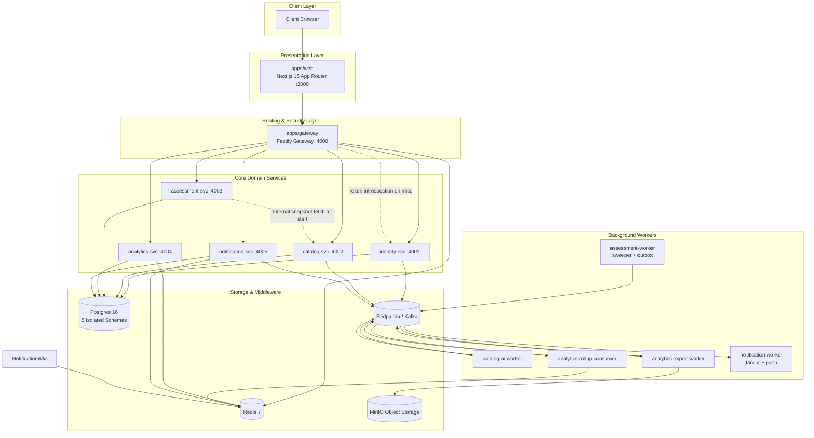

# Quiz Platform: Comprehensive Technical Interview Questions & Answers

This document serves as an exhaustive architectural and system design interview guide for the Quiz Platform repository. It is structured to answer all interrelated technical questions spanning distributed systems, database design, event-driven architecture, caching strategies, and resilience engineering as implemented in this codebase.

---

## Table of Contents

1. [Architecture & Distributed System Fundamentals](#1-architecture--distributed-system-fundamentals)
2. [Service Topology & Microservice Boundaries](#2-service-topology--microservice-boundaries)
3. [Data Storage: Postgres Schemas, Models & Physical Design](#3-data-storage-postgres-schemas-models--physical-design)
4. [Kafka & Event-Driven Architecture (EDA)](#4-kafka--event-driven-architecture-eda)
5. [Redis Responsibilities, Caching Strategies & Trade-offs](#5-redis-responsibilities-caching-strategies--trade-offs)
6. [End-to-End Execution Flows & Deep-Dive Scenarios](#6-end-to-end-execution-flows--deep-dive-scenarios)
7. [Security, Integrity & Anti-Cheating Architecture](#7-security-integrity--anti-cheating-architecture)
8. [Reliability, Failure Modes & Disaster Recovery](#8-reliability-failure-modes--disaster-recovery)

---

## 1. Architecture & Distributed System Fundamentals

### Q1.1: What is the high-level architecture of this platform in one sentence?
**Answer:**
The Quiz Platform is an event-driven, schema-isolated microservices architecture where the browser communicates exclusively with a Next.js 15 frontend, which proxies requests through a Fastify API Gateway that terminates authentication and enforces rate limits before dispatching to single-purpose backend services that own independent PostgreSQL schemas and exchange state asynchronously via Kafka (Redpanda) and Redis.



---

### Q1.2: Why was this system split into microservices instead of staying as a modular monolith? What specific problems did the split solve?
**Answer:**
A quiz platform possesses fundamentally asymmetric workload characteristics across its functional domains:
1. **Divergent Scalability & Resource Profiles:**
   - **Assessment (High Write / Low Latency):** During live tests, hundreds or thousands of students submit answers concurrently via autosave (`PATCH /attempts/:id/answers`). Autosaves must be fast, resilient, and never block on heavy analytical computations.
   - **Catalog (Read-Heavy / Low Mutation):** Quizzes, chapters, and subjects are read frequently by browsing students but mutated infrequently by admins.
   - **Analytics & Export (CPU & Memory Intensive):** Calculating rollups, percentiles, and streaming multi-megabyte CSV exports creates substantial memory and query pressure. In a monolith, this starved the student answer ingestion path.
   - **AI Generation & Notifications (Slow I/O & Connection Holding):** Google Gemini calls take 5–30 seconds per section. Push notifications to Apple/Google and long-lived Server-Sent Events (SSE) connections consume socket descriptors and event-loop cycles. Isolating them prevents worker starvation.
2. **Blast Radius Isolation:**
   A bug in CSV export generation or a slow response from Gemini cannot crash the process handling live quiz attempts. An out-of-memory error during export generation only terminates `analytics-export-worker`.
3. **Data Integrity & Answer Key Security:**
   By separating Catalog from Assessment and Frontend, the authoritative answer keys (`correctAnswer`, explanations) are physically and logically shielded from the client until after an attempt is completed and submitted.

---

### Q1.3: How does request correlation and observability work across service boundaries?
**Answer:**
Distributed tracing is achieved using request-scoped Trace IDs via `@quiz/observability`:
- The API Gateway generates a unique `x-trace-id` (UUID v4) for every inbound request if not already present.
- This `x-trace-id` is forwarded downstream in HTTP headers by `apps/web/lib/gateway-client.ts` and the Gateway proxy plugin.
- Every Fastify microservice registers an `onRequest` hook that extracts `x-trace-id` and binds it to a child Pino logger instance.
- When an event is produced to Kafka, the `traceId` is embedded inside the standard `EventEnvelope<T>`. When workers consume this message, they re-attach the `traceId` to their logger context.
- **Trade-off:** The system currently relies on lightweight structured logging (Pino) and manual header/envelope propagation rather than full OpenTelemetry (OTel) collectors and span exporters. This avoids the CPU/memory footprint of OTel agent daemons while providing complete end-to-end grep-ability across microservices.

---

## 2. Service Topology & Microservice Boundaries

### Q2.1: List every service and background process in the system and define their responsibilities.
**Answer:**
There are **6 deployable services** operating **12 distinct processes**:

| Service / App | Process Name | Communication / Port | Authoritative Domain Responsibilities |
|---|---|---|---|
| **apps/web** | Next.js Server | HTTP :3000 | Next.js 15 presentation layer, React 18 UI, server components, and thin `/api/**` gateway proxy routes. Holds no database connection. |
| **apps/gateway** | Fastify Gateway | HTTP :4000 | Single public entry point. Authentication termination, token introspection caching, identity header scrubbing, sliding-window rate limiting, and reverse proxying to downstream services. |
| **apps/identity** | identity-svc | HTTP :4001 | User accounts, credentials, role management, opaque token validation, and transactional outbox publisher (in-process). |
| **apps/catalog** | catalog-svc | HTTP :4002 | Subjects, chapters, quizzes, question bank items, answer keys, optimistic concurrency control on quiz edits. |
|  | catalog-ai-worker | Kafka Consumer | Consumes `AI_QUIZ_GENERATION_REQUESTED`, orchestrates multi-section prompts to Google Gemini 1.5 Flash, persists partial progress, and creates draft quizzes. |
| **apps/assessment** | assessment-svc | HTTP :4003 | Starting attempts, fetching immutable quiz snapshots, handling student autosaves, server-side scoring on submit, and recording spaced-repetition notebook items. |
|  | assessment-worker | Background Worker | Sweeps expired `IN_PROGRESS` attempts every 15s; polls and publishes assessment transactional outbox events to Kafka every 2s. |
| **apps/analytics** | analytics-svc | HTTP :4004 | Admin and user read models, dashboards, leaderboard read endpoints, and initiating CSV export jobs. |
|  | analytics-rollup-consumer | Kafka Consumer | Consumes `ATTEMPT_SUBMITTED`, entity changes, and maintains fact tables, daily rollups, user/quiz statistics, distractor counts, and Redis leaderboards. |
|  | analytics-export-worker | Kafka Consumer | Consumes `EXPORT_REQUESTED`, keyset-pages large datasets, generates CSV streams, and uploads multipart archives to MinIO. |
| **apps/notification** | notification-svc | HTTP :4005 | Announcements CRUD, per-user read tracking, Web Push subscription management, and SSE connection endpoint (`/v1/stream`). |
|  | notification-worker | Kafka Consumer | Two-stage fanout: stage 1 consumes `ANNOUNCEMENT_PUBLISHED` and batches push jobs; stage 2 consumes `PUSH_SEND_REQUESTED` and delivers to Web Push providers. |

---

### Q2.2: How are service boundaries strictly enforced between microservices?
**Answer:**
1. **Network Boundary:**
   Only the Fastify Gateway port (`4000`) and Next.js Web port (`3000`) are exposed to the public Internet. Downstream microservices (`4001–4005`) and their internal endpoints (e.g., `/internal/quizzes/:id/full`, `/v1/internal/introspect`) bind within an internal Docker network and are unreachable by external clients.
2. **Identity Header Scrubbing:**
   External clients might attempt to spoof identity by sending `x-user-id` or `x-user-is-admin`. The API Gateway strips all inbound `x-user-*` and `expect` headers before setting verified values from token introspection. Downstream services trust these headers implicitly via their local `auth.ts` helper.
3. **Database Separation (Physical Schema Isolation):**
   No cross-service database access is permitted. Even though a single PostgreSQL 16 instance is used, each service connects with a unique role whose `search_path` is restricted to its own schema. PostgreSQL role permissions actively block cross-schema queries.
4. **Soft References Only:**
   Entities across services refer to each other by string IDs (e.g., `Attempt.quizId`, `Attempt.userId`). There are zero cross-schema foreign keys. Cascades do not exist across boundaries; consistency is maintained via events.

---

## 3. Data Storage: Postgres Schemas, Models & Physical Design

### Q3.1: How is data stored physically in PostgreSQL, and why use "schema-per-service" over multiple database instances?
**Answer:**
The database architecture uses a **Single Database, Schema-Per-Service Pattern**:
- **Database:** One PostgreSQL 16 database named `quiz`.
- **Schemas & Roles:**
  - `identity` schema owned by `identity_rw`
  - `catalog` schema owned by `catalog_rw`
  - `assessment` schema owned by `assessment_rw`
  - `analytics` schema owned by `analytics_rw`
  - `notification` schema owned by `notification_rw`

```sql
-- Role and schema setup snippet from infra/postgres/init/01-schemas-roles.sql
CREATE SCHEMA identity AUTHORIZATION identity_rw;
ALTER ROLE identity_rw SET search_path TO identity;
REVOKE ALL ON SCHEMA identity FROM PUBLIC;
GRANT ALL ON SCHEMA identity TO identity_rw;
```

**Why this architectural choice? (Trade-off Analysis):**
- **Advantages over 5 Separate DB Servers:**
  - **Resource Efficiency:** Running 5 independent PostgreSQL instances on local developer machines or small cloud instances (e.g., Oracle Cloud Free Tier or VPS) would incur significant RAM and CPU overhead (buffer pools, WAL writers, connection pools).
  - **Operational Simplicity:** Single backup target (`pg_dump`), single replication stream, single point of point-in-time recovery (PITR), and simplified connection pooling via PgBouncer.
- **Advantages over a Shared Monolithic Schema:**
  - **Enforced Boundaries:** Physical role isolation prevents developers from writing cross-service joins (`JOIN identity.User ON ...`) in Prisma or raw SQL.
  - **Decoupled Migrations:** Each service maintains its own Prisma schema and migration history (`prisma/migrations`). Services can deploy schema migrations independently without locking tables in other domains.
  - **Independent Scalability/Extraction:** If `analytics` or `assessment` outgrows the server, its schema can be cleanly dumped and restored onto a dedicated PostgreSQL cluster with zero application code changes (merely updating `DATABASE_URL`).

---

### Q3.2: What is stored in each service's schema? Walk through the key models.
**Answer:**

#### 1. Identity Schema (`identity_rw`)
- **`User`**: `id`, `name`, `email` (unique), `password` (plaintext in current iteration), `isAdmin`, `userType` (admin/student), `lastLogin`, `totalQuizzes`, `averageScore`.
- **`Outbox`**: Relational outbox storing events (`USER_CHANGED`) committed atomically with user profile mutations.

#### 2. Catalog Schema (`catalog_rw`)
- **`Subject`**: High-level subject metadata (`id`, `name` [unique], `description`, `icon`, `color`).
- **`Chapter`**: Granular chapter metadata linked to a `subjectId`.
- **`Quiz`**: Core quiz configuration (`id`, `title`, `timeLimit`, `sections` [JSON string array], `questions` [JSON string containing questions, options, and `correctAnswer`], `negativeMarking`, `negativeMarkValue`, `isActive`, `version` [integer for optimistic locking]).
- **`QuestionBankItem`**: Reusable questions (`question`, `options` [JSON], `correctAnswer`, `explanation`, `difficulty`, `tags` [JSON], `usageCount`).
- **`AiGenerationJob`**: Tracks asynchronous AI quiz generation (`status`, `partialQuestions` [JSON accumulator], `failures` [JSON], `resultQuizId`).
- **`Outbox`**: Outbox table for `QUIZ_CHANGED`, `CHAPTER_CHANGED`, `SUBJECT_CHANGED`.

#### 3. Assessment Schema (`assessment_rw`)
- **`Attempt`**: Authoritative record of an exam sitting. Tracks `id`, `userId`, `quizId`, `userName`, `userEmail`, `snapshotId`, `status` (`IN_PROGRESS`, `SUBMITTED`, `EXPIRED`, `ABANDONED`), `startedAt`, `expiresAt`, `submittedAt`, `submitSource` (e.g., `"client"`, `"sweeper"`), `clientIdemKey`, `rawScore`, `totalScore`, `correctCount`, `wrongCount`, `unansweredCount`, `sectionScores` (frozen JSON breakdown).
- **`AttemptSnapshot`**: Immutable snapshot of the quiz taken at attempt start. Contains `quizId`, `quizTitle`, `quizVersion`, `contentHash`, `timeLimitSec`, `negativeMarking`, `negativeMarkValue`, `sections` (JSON), `questions` (JSON with answer keys). Deduped on `(quizId, contentHash)`.
- **`AttemptAnswer`**: Live student responses. Composite primary key `[attemptId, questionId]`. Stores `selectedOption`, `markedForReview`, `visited`, `timeSpentMs`, `clientSeq` (sequence number for race prevention), `isCorrect`, `awarded`.
- **`NotebookItem`**: Student mistake review and bookmark system. Implements Leitner spaced repetition: `boxLevel` (1–5), `nextPracticeAt`, `selectedAnswer`, `correctAnswer`, `explanation`.
- **`QuizResult`**: Legacy attempt table maintained for backwards compatibility.
- **`Outbox`**: Outbox storing `ATTEMPT_STARTED` and `ATTEMPT_SUBMITTED`.

#### 4. Analytics Schema (`analytics_rw`)
*Note: Analytics owns zero authoritative data; all tables are derived read-model projections rebuildable from Kafka.*
- **Dimensions:** `DimUser`, `DimQuiz`, `DimChapter`, `DimSubject`. Populated by consuming entity change topics.
- **Facts:**
  - `AttemptFact`: One row per completed attempt (`attemptId`, `userId`, `quizId`, `chapterId`, `subjectId`, `submittedAt`, `submittedDate` [UTC midnight truncated], scores, counts, timings).
  - `AttemptSectionFact`: Granular per-section performance (`attemptId`, `section`, `correct`, `wrong`, `scorePct`).
- **Aggregates & Statistics:**
  - `QuestionStat`: Per-question difficulty and distractor analysis (`quizId`, `questionId`, `attempts`, `correct`, `wrong`, `optionCounts` JSON tracking selections per option).
  - `UserStats`: Rollup of user performance (`attempts`, `bestScore`, `avgScore`, `last20Scores` float array, `currentStreakDays`, `longestStreakDays`).
  - `QuizStats`: Rollup of quiz performance (`attempts`, `uniqueUsers`, `avgScore`, `passCount`).
  - `DailyRollup`: High-speed pre-aggregated reporting buckets for 30-day dashboard charts (`bucketDate`, `quizId`, `subjectId`, `attempts`, `uniqueUsers`, `sumScore`). Uses sentinel string `"__all__"` for cross-quiz/subject grouping.
  - `QuizUserSeen`: Composite key `[quizId, userId]` used with `INSERT ... ON CONFLICT DO NOTHING` to accurately increment `uniqueUsers` without expensive `COUNT(DISTINCT)` table scans.
- **`ExportJob`**: State tracking for async CSV downloads (`kind`, `filters`, `status`, `objectKey`, `rowCount`, `bytes`).
- **`ProcessedEvent`**: Consumer idempotency ledger (`eventId`, `consumerGroup`, `processedAt`).

#### 5. Notification Schema (`notification_rw`)
- **`Announcement`**: Broadcast or targeted messages (`id`, `title`, `content`, `priority`, `isActive`, `expiresAt`).
- **`AnnouncementRead`**: Read receipts tracking `[announcementId, userId]`.
- **`PushSubscription`**: Web Push endpoint credentials (`userId`, `endpoint` [unique], `p256dh`, `auth`, `isActive`).
- **`UserRef`**: Local projection of user names and emails for push targeting.
- **`ProcessedEvent` & `Outbox`**: Idempotency and outbox tables.

---

### Q3.3: Why does `AttemptSnapshot` exist in the Assessment service? What bug does it solve?
**Answer:**
`AttemptSnapshot` solves the **Mid-Exam Mutation Dilemma**:
- In naive quiz systems, when a student submits an attempt, the scoring engine queries the live `Quiz` and `Question` tables in the catalog.
- **The Bug:** If an instructor edits a question typo, alters an answer key, changes the time limit, or deletes a question while 500 students are actively taking the quiz, students will experience inconsistent scoring, runtime crashes, or grading against questions they were never shown.
- **The Solution:**
  1. When `POST /v1/attempts` is called, Assessment calls Catalog's internal endpoint (`GET /internal/quizzes/:id/full`) exactly once.
  2. Assessment freezes the quiz title, version, negative marking rules, sections, and questions (including `correctAnswer` and explanations) into an `AttemptSnapshot` row.
  3. Subsequent attempts for the identical quiz state reuse the snapshot via `(quizId, contentHash)` deduplication.
  4. All student scoring and post-exam reviews read strictly from the immutable snapshot. Admin changes to the catalog never invalidate ongoing or historical attempts.

---

### Q3.4: What are the critical PostgreSQL indexes in Assessment that Prisma cannot generate, and why are they vital?
**Answer:**
Prisma’s schema DSL cannot define PostgreSQL **partial indexes** (indexes with a `WHERE` clause). Two critical partial indexes are defined in migration SQL (`0002_partial_indexes.sql`):

```sql
-- 1. Enforce at most one live attempt per user per quiz
CREATE UNIQUE INDEX attempt_one_inflight 
ON assessment."Attempt" (user_id, quiz_id) 
WHERE status = 'IN_PROGRESS';

-- 2. Enable ultra-fast timer sweeping of expired attempts
CREATE INDEX attempt_sweeper 
ON assessment."Attempt" (expires_at) 
WHERE status = 'IN_PROGRESS';
```

**Why they are vital:**
1. `attempt_one_inflight`: Enforces business correctness at the storage engine level. If a user clicks "Start Quiz" simultaneously in multiple tabs or sends rapid concurrent POST requests, the database guarantees that only one `IN_PROGRESS` attempt can exist. Without the partial condition, a user could never take the same quiz twice after submitting the first one.
2. `attempt_sweeper`: The background sweeper runs every 15 seconds querying for attempts where `status = 'IN_PROGRESS' AND expires_at <= NOW()`. As historical submitted attempts grow into millions of rows, a standard index on `(expires_at)` would become huge and slow. The partial index contains only the active in-flight attempts (typically a few dozen or hundred rows), making the sweeper query execute in sub-millisecond time.

---

## 4. Kafka & Event-Driven Architecture (EDA)

### Q4.1: What is Kafka (Redpanda) doing in this architecture? Why not use synchronous REST calls between microservices?
**Answer:**
Kafka serves as the **asynchronous event backbone** for Event-Carried State Transfer (ECST) and decoupled workflow execution:
1. **Eliminating Temporal Coupling:**
   If the Assessment service relied on synchronous HTTP calls to notify Analytics and Notification upon quiz submission, a failure, network timeout, or high load in the Analytics service would cause the student's quiz submission to fail or hang. With Kafka, Assessment commits the submission locally, and downstream consumers process the result asynchronously.
2. **Event-Carried State Transfer:**
   Events like `ATTEMPT_SUBMITTED` include all necessary context (attempt ID, user ID, user display name, quiz ID, quiz title, score, section breakdown, question-level correctness, and time spent). Consumers (Analytics, Notification) never need to call back into Assessment or Identity to hydrate data, preventing circular HTTP dependencies and cascading failures.
3. **Replayability & Zero-Downtime Re-indexing:**
   Because Kafka retains events durably on disk, the entire Analytics service can be wiped, upgraded, or refactored, and its state completely reconstructed simply by resetting its consumer group offset to `0` (from beginning).
4. **Buffering Load Spikes:**
   When an exam ends for 5,000 students simultaneously, submissions spike violently. Kafka acts as a shock absorber. Consumers process the backlog at their maximum sustainable throughput without overwhelming the database.

---

### Q4.2: What is the Transactional Outbox Pattern, and how is it implemented in `packages/kafka-kit`?
**Answer:**
The **Transactional Outbox Pattern** solves the Dual-Write Problem (the impossibility of atomically committing to a relational database and publishing to a message broker without distributed 2-Phase Commit transactions).

#### How it works in this platform:
1. **Atomic Local Write:**
   When an attempt is submitted, the business update (`UPDATE Attempt SET status = 'SUBMITTED'`) and an insert into the `Outbox` table occur inside the **same PostgreSQL interactive transaction**:
   ```ts
   await prisma.$transaction(async (tx) => {
     await tx.attempt.update({ where: { id }, data: { status: 'SUBMITTED', ... } })
     await tx.outbox.create({
       data: {
         topic: TOPICS.ATTEMPT_SUBMITTED,
         key: userId,
         payload: envelope,
         headers: { 'x-trace-id': traceId }
       }
     })
   })
   ```
2. **Outbox Poller with `FOR UPDATE SKIP LOCKED`:**
   A background poller (`startOutboxPublisher`) runs every 2 seconds. It claims batches using:
   ```sql
   SELECT * FROM "Outbox"
   WHERE published_at IS NULL
   ORDER BY id ASC
   LIMIT 100
   FOR UPDATE SKIP LOCKED;
   ```
3. **Lock Retention & Batch Publication (`packages/kafka-kit/src/outbox.ts`):**
   The claim query, Kafka publish (`producer.sendBatch`), and update (`UPDATE Outbox SET published_at = NOW() WHERE id IN (...)`) are bound to the **same transaction**.
   - *Why this design matters:* If claim and mark were two separate autocommitted calls, the row lock would be released after the `SELECT`. A second concurrent publisher process could claim the exact same rows before the first completed publishing, producing duplicate Kafka messages. By combining claim and mark inside `withClaimedBatch`, duplicate claiming is physically impossible.

---

### Q4.3: Enumerate all Kafka topics in the system, their producers, consumers, partition keys, and business purposes.
**Answer:**

| Topic Name | Producer Process | Consumer Process | Message Key | Business Purpose |
|---|---|---|---|---|
| `quiz.assessment.attempt-submitted.v1` | `assessment-worker` (outbox) | `analytics-rollup-consumer` | `userId` | **Fact stream.** Authoritative record of completed quiz, scores, and question outcomes. Replayed to build analytics facts and leaderboards. Keyed by `userId` to maintain per-user submission order. |
| `quiz.assessment.attempt-started.v1` | `assessment-worker` (outbox) | `analytics-rollup-consumer` | `userId` | Lifecycle notification when an attempt begins. Currently advances consumer offset. |
| `quiz.catalog.quiz-changed.v1` | `catalog-svc` (outbox) | `analytics-rollup-consumer` | `quizId` | **Compacted entity stream.** Emits full quiz metadata when created/updated; emits tombstone (`payload: null`) when deleted to remove from `DimQuiz`. |
| `quiz.catalog.chapter-changed.v1` | `catalog-svc` (direct) | `analytics-rollup-consumer` | `chapterId` | **Compacted entity stream.** Emits chapter updates. Analytics uses this to backfill/repair `subjectId` on previously orphaned quizzes. |
| `quiz.catalog.subject-changed.v1` | `catalog-svc` (direct) | `analytics-rollup-consumer` | `subjectId` | **Compacted entity stream.** Maintains `DimSubject` dimension. |
| `quiz.identity.user-changed.v1` | `identity-svc` (outbox) | `analytics-rollup-consumer`, `notification-worker` | `userId` | **Compacted entity stream.** Emits user creations/logins. Updates `DimUser` in Analytics and `UserRef` in Notification. |
| `quiz.identity.user-erasure-requested.v1` | `identity-svc` (direct) | `analytics-rollup-consumer`, `notification-worker` | `userId` | GDPR deletion request. Analytics redacts name/email and sets `deletedAt`. Notification hard-deletes Web Push credentials. |
| `quiz.notification.announcement-published.v1` | `notification-svc` (outbox / direct repush) | `notification-worker` (stage 1) | `announcementId` | Triggers SSE broadcast via Redis and fans out push notification tasks. |
| `quiz.notification.push-send-requested.v1` | `notification-worker` (stage 1) | `notification-worker` (stage 2) | `userId` | Fine-grained delivery job containing only `subscriptionId`. Worker loads push secrets and calls browser push endpoints. |
| `quiz.ai.quiz-generation-requested.v1` | `catalog-svc` (direct) | `catalog-ai-worker` | `jobId` | Prompts background AI worker to begin multi-section Gemini question generation. |
| `quiz.ai.quiz-generation-completed.v1` | `catalog-ai-worker` (direct) | None (future webhook / notification) | `jobId` | Signals completion of AI quiz generation. Client currently polls job row. |
| `quiz.analytics.export-requested.v1` | `analytics-svc` (direct) | `analytics-export-worker` | `jobId` | Prompts worker to stream large CSV dataset to MinIO object storage. |
| `quiz.analytics.export-completed.v1` | `analytics-export-worker` (direct) | None (future webhook) | `jobId` | Signals export completion. Client polls job status to obtain presigned S3 download URL. |

---

### Q4.4: How does consumer-side deduplication and idempotency work? How does the system handle poison pills?
**Answer:**
Kafka guarantees **at-least-once delivery**. Messages can be re-delivered during network blips, rebalances, or process crashes.

#### 1. Transactional Consumer Idempotency (`analytics-rollup-consumer`)
In `packages/kafka-kit/src/consumer.ts` and `apps/analytics/src/worker.ts`:
- Every message carries a unique `eventId` in its `EventEnvelope`.
- Before processing, `runConsumer` checks if `eventId` exists in the local `ProcessedEvent` table.
- When applying projections (e.g., updating `AttemptFact`, `UserStats`, `DailyRollup`), the handler inserts `(eventId, consumerGroup, NOW())` into `ProcessedEvent` **within the exact same database transaction**.
- If a duplicate message arrives, the unique constraint on `ProcessedEvent.eventId` causes the transaction to roll back cleanly, guaranteeing that projection counters are never incremented twice.

#### 2. Poison Pills and Dead Letter Queue (DLQ) Architecture
A poison pill is a message that cannot be processed (e.g., malformed JSON, corrupted data, or logic bugs) and would otherwise cause the consumer group to crash-loop forever.
`processMessage` in `packages/kafka-kit/src/consumer.ts` enforces a strict policy:
1. **Parse & Envelope Validation Failures:**
   If a message is not valid JSON or lacks mandatory envelope fields (`eventId`, `eventType`, `data`), retrying will never succeed. It is immediately routed to `<topic>.dlq` with failure headers (`dlq-error`, `dlq-failed-at`) and consumer offset advances.
2. **Transient Handler Failures:**
   If the business handler throws an exception (e.g., database deadlock or temporary network blip), the message is retried in-process up to **3 times with exponential backoff** (500ms, 1000ms, 2000ms, capped at 5000ms).
3. **Dead-Letter Routing:**
   If all retries are exhausted, the message is published to `<topic>.dlq`.
4. **Resilience Invariant:**
   If publishing to the DLQ itself fails, the original error is rethrown so Kafka's native redelivery mechanisms apply. The system prioritizes data safety over silent loss.

---

## 5. Redis Responsibilities, Caching Strategies & Trade-offs

### Q5.1: What is stored in Redis? Detail all key patterns and their TTLs.
**Answer:**
All Redis keys are centralized in `packages/redis-kit/src/keys.ts` with the mandatory prefix `q:`. Logical separation is achieved via structured prefixes rather than Redis database indexes:

| Key Builder | Key Pattern | Type | TTL | Purpose |
|---|---|---|---|---|
| `tokenCache` | `q:auth:token:<token>` | String | 120s | Caches Gateway introspection results (`userId`, `isAdmin`, etc.) or empty string for cached invalid tokens. |
| `rateLimit` | `q:rl:<policy>:<subject>:<windowStart>` | String (Counter) | 2x window duration | Counters for approximate sliding-window rate limiting. |
| `leaderboardQuiz` | `q:lb:quiz:<quizId>` | Sorted Set (ZSET) | None (Persistent) | Per-quiz leaderboard. Member: `userId`, Score: composite score. |
| `leaderboardSubject` | `q:lb:subject:<subjectId>` | Sorted Set (ZSET) | None (Persistent) | Per-subject aggregated leaderboard. |
| `leaderboardGlobal` | `q:lb:global` | Sorted Set (ZSET) | None (Persistent) | Global all-time leaderboard. |
| `leaderboardWeekly` | `q:lb:weekly:<ISO-week>` | Sorted Set (ZSET) | 9 days | Weekly leaderboard (e.g., `2026-W38`). Self-expiring. |
| `leaderboardNames` | `q:lb:names` | Hash (HSET) | None (Persistent) | Fast mapping of `userId` -> display `userName`. |
| `cacheAnalyticsOverview` | `q:cache:analytics:overview` | String (JSON) | 300s | Caches expensive aggregate dashboard metrics. |
| `cacheAnalyticsQuiz` | `q:cache:analytics:quiz:<quizId>` | String (JSON) | 300s | Caches per-quiz analytics views. |
| `cacheAnalyticsUser` | `q:cache:analytics:user:<userId>` | String (JSON) | 300s | Caches per-user analytics views. |
| `sseTicket` | `q:sse:ticket:<ticketId>` | String | 30s | Single-use tickets for authenticating EventSource connections. |
| `sseBacklog` | `q:sse:backlog:<userId>` | List | 1 hour | Capped buffer (max 50 events) for missed notifications during SSE reconnection. |
| `pubsubUser` | `q:pubsub:user:<userId>` | Pub/Sub Channel | N/A | Targeted real-time notifications to a specific connected user. |
| `pubsubBroadcast` | `q:pubsub:broadcast` | Pub/Sub Channel | N/A | System-wide broadcast notifications to all connected SSE clients. |

---

### Q5.2: How does the Redis leaderboard score encoding work? Why this specific formula?
**Answer:**
Redis Sorted Sets (`ZSET`) order members by a single 64-bit floating-point number (`double`).
A competition quiz leaderboard must sort users primarily by **Score Percentage** (higher is better) and break ties by **Time Spent** (faster completion is better).

#### The Composite Integer Encoding Formula:
```ts
// From packages/redis-kit/src/leaderboard.ts
export function encodeLeaderboardScore(totalScorePct: number, timeSpentSec: number): number {
  const scorePart = Math.round(totalScorePct * 100) * 1_000_000
  const timePart = 999_999 - Math.min(timeSpentSec, 999_999)
  return scorePart + timePart
}
```

#### Why this math works:
1. **Primary Dominance:**
   `totalScorePct` (0.00% to 100.00%) is multiplied by 100 (yielding 0 to 10,000 integer basis points) and shifted up by `1,000,000`. A 1% increase in score adds `100,000,000` to the encoded score, completely overshadowing any possible time difference.
2. **Tie-Breaking by Speed:**
   `timeSpentSec` is inverted: `999_999 - timeSpentSec`. If two users score 85.50%:
   - User A finishes in 120 seconds: `timePart = 999,999 - 120 = 999,879`.
   - User B finishes in 300 seconds: `timePart = 999,999 - 300 = 999,699`.
   - User A has a strictly higher encoded score and ranks higher.
3. **Floating-Point Precision Safety:**
   JavaScript `number` and Redis sorted set scores use IEEE 754 double precision floats, which guarantee exact integer representation up to $2^{53} - 1 \approx 9 \times 10^{15}$. The maximum possible encoded score is $(10,000 \times 1,000,000) + 999,999 \approx 1.0 \times 10^{10}$, safely within exact integer precision. No precision degradation or rounding error can occur.

#### Atomic "Best Score Only" via `ZADD ... GT`:
When recording scores, the platform executes:
```text
ZADD q:lb:quiz:<quizId> GT CH <encodedScore> <userId>
```
The `GT` (Greater Than) flag guarantees that Redis updates the record only if the new score is strictly greater than the user's existing record. This completely eliminates read-then-write race conditions and ensures a student's worse retry never downgrades their leaderboard rank.

---

### Q5.3: How does the sliding-window rate limiting algorithm work in Redis? Why was it chosen over alternatives?
**Answer:**
Rate limiting is enforced at the Fastify Gateway using an **Approximate Sliding Window** implemented via a single atomic Lua script (`packages/redis-kit/src/rateLimit.ts`).

#### Algorithm Mechanics:
The algorithm estimates the current request rate by weighting the counts of two fixed windows (the current window and the previous window):
$$\text{estimated} = (\text{prev\_count} \times (1 - \text{weight})) + \text{curr\_count}$$
where $\text{weight} = \frac{\text{elapsed\_time\_in\_current\_window}}{\text{window\_duration}}$.

```lua
-- Snippet from packages/redis-kit/src/rateLimit.ts
local elapsed_in_curr = now % window_ms
local weight = elapsed_in_curr / window_ms
local prev_count = tonumber(redis.call("GET", prev_key) or "0")
local curr_count = tonumber(redis.call("GET", curr_key) or "0")
local estimated = (prev_count * (1 - weight)) + curr_count

if estimated >= limit then
  return { 0, math.floor(estimated), limit }
end

curr_count = redis.call("INCR", curr_key)
if curr_count == 1 then
  redis.call("PEXPIRE", curr_key, window_ms * 2)
end
return { 1, math.floor(estimated) + 1, limit }
```

#### Why this algorithm was chosen (Trade-off Analysis):
1. **vs. Sliding Window Log:**
   A sliding window log stores a Redis `ZSET` of timestamps per user/IP. While 100% accurate, its memory footprint is $O(N)$ where $N$ is the number of requests. Under high autosave or DDoS traffic, memory consumption explodes. The sliding window approximation uses only 2 small string keys ($O(1)$ memory).
2. **vs. Fixed Window Counter:**
   Fixed window counters suffer from boundary bursts (e.g., sending 300 requests at 00:59 and 300 requests at 01:01 allows 2x the rate limit within 2 seconds). The weighted sliding calculation completely smooths out window edge bursts.
3. **vs. Token Bucket:**
   While Token Bucket provides smooth pacing, it maintains continuous fractional state that makes answering "why was this request rejected at this specific second" difficult to inspect and debug. The two-window approximation behaves intuitively.

---

### Q5.4: What are the trade-offs of caching token introspection in Redis? What happens during cache inconsistency?
**Answer:**
When an authenticated request hits the Gateway with an opaque bearer token:
1. Gateway checks `q:auth:token:<token>`.
2. On miss, it invokes `POST identity-svc/v1/internal/introspect` and stores the verified identity payload in Redis with a **120-second TTL**.

**Trade-offs Involved:**
- **Positive (Latency & Load Reduction):**
  Without caching, every single HTTP request (including rapid autosaves) would trigger an HTTP hop from Gateway to Identity and a PostgreSQL query on `identity.User`. The cache reduces authentication overhead to a sub-millisecond Redis `GET`.
- **Negative (Revocation Lag):**
  If an administrator revokes a user's permissions, changes their role, or deletes their account, the user can continue executing requests for up to 120 seconds until the Redis key expires. This 2-minute eventual consistency window was an intentional architectural trade-off favoring performance over instantaneous revocation.
- **Negative Caching:**
  If an invalid token is introspected, an empty string is cached for 120s. This protects the Identity service from denial-of-service attacks using randomly generated bad tokens.
- **Fault Resilience:**
  If Identity service goes down, the Gateway returns HTTP 503 instead of caching errors or returning false 401s.

---

### Q5.5: What must Redis NEVER exclusively own? What is the system's disaster recovery model if Redis crashes?
**Answer:**
**Inviolable Architectural Rule:** Redis is treated as an **ephemeral accelerator and coordination cache**, never as the primary system of record.

#### Redis must NEVER exclusively own:
- User accounts, credentials, or password hashes (owned by `identity.User`).
- Live or submitted quiz attempts (owned by `assessment.Attempt`).
- Student answers (owned by `assessment.AttemptAnswer`).
- Authoritative quiz content and answer keys (owned by `catalog.Quiz`).
- Official scores, percentiles, or exam analytics (owned by `analytics.AttemptFact`).
- Web push subscriptions and encryption secrets (owned by `notification.PushSubscription`).

#### Disaster Recovery Scenario: Total Redis Failure:
If the Redis container crashes, is flushed (`FLUSHALL`), or loses persistence:
1. **No Data Loss:** Zero student answers, quiz attempts, or user records are lost.
2. **Self-Healing Caches:** Auth token and analytics overview caches re-populate automatically on cache misses from PostgreSQL.
3. **Leaderboard Reconstruction:** The Analytics rollup consumer can rebuild all leaderboards (`q:lb:*`) by re-evaluating historical `AttemptFact` records.
4. **SSE Reconnection:** Connected browsers experience an SSE disconnect, re-request a fresh stream ticket via HTTP from `notification-svc`, and reconnect with automatic backlog replay based on `Last-Event-ID`.
5. **Rate Limiting:** Counters reset to zero, temporarily permitting fresh quota windows.

---

## 6. End-to-End Execution Flows & Deep-Dive Scenarios

### Q6.1: Trace the complete end-to-end lifecycle when a student clicks "Submit Quiz".
**Answer:**
This is the most critical workflow in the platform, traversing all layers of the architecture:

```mermaid
sequenceDiagram
    autonumber
    participant B as Browser
    participant W as apps/web (Next.js)
    participant G as apps/gateway
    participant A as assessment-svc
    participant P as assessment (Postgres)
    participant K as Redpanda (Kafka)
    participant C as analytics-rollup-consumer
    participant AP as analytics (Postgres)
    participant R as Redis

    B->>W: POST /api/attempts/:id/submit
    W->>G: Forward to /v1/attempts/:id/submit
    G->>R: Verify rate limit (submit:attempt: 5/min)
    G->>R: Read cached auth token
    G->>A: Proxy with scrubbed x-user-* headers
    
    rect rgb(240, 248, 255)
        Note over A,P: Atomic Submit & Scoring Transaction
        A->>P: UPDATE Attempt SET status='SUBMITTED' WHERE id=:id AND status='IN_PROGRESS'
        alt 0 rows updated
            A-->>G: 409 Conflict (or replay if already SUBMITTED)
        end
        A->>P: Load AttemptSnapshot (answer keys) + saved AttemptAnswers
        A->>A: Compute score, negative marks, section breakdown, mistake list
        A->>P: UPDATE Attempt totals, sectionScores, timeSpentMs
        A->>P: UPDATE AttemptAnswers with isCorrect, awarded
        A->>P: INSERT Leitner NotebookItems for incorrect answers
        A->>P: INSERT Outbox (ATTEMPT_SUBMITTED)
        A-->>G: 200 OK + full results & answer explanations
    end

    G-->>W-->>B: Render Results Page

    rect rgb(255, 250, 240)
        Note over A,K: Outbox Publishing Loop
        A->>P: SELECT Outbox FOR UPDATE SKIP LOCKED
        A->>K: Produce ATTEMPT_SUBMITTED (keyed by userId)
        A->>P: UPDATE Outbox SET published_at = NOW()
    end

    rect rgb(240, 255, 240)
        Note over K,AP: Analytics Rollup Projection
        K->>C: Consume ATTEMPT_SUBMITTED
        C->>AP: Transaction: Check & INSERT ProcessedEvent
        C->>AP: INSERT AttemptFact & AttemptSectionFact
        C->>AP: Upsert QuestionStat (distractor counts)
        C->>AP: Upsert UserStats & QuizStats
        C->>AP: Upsert DailyRollup buckets
        C->>AP: Commit Transaction
        C->>R: ZADD leaderboards (GT flag) & invalidate analytics cache
    end
```

#### Step-by-Step Breakdown:
1. **Client & Gateway:** Browser calls `/api/attempts/:id/submit`. Gateway checks the `submit:attempt` rate limit (max 5/min), validates token via Redis, strips untrusted headers, adds `x-user-id`, and proxies to Assessment.
2. **Optimistic Compare-and-Swap (CAS):** Assessment executes:
   ```sql
   UPDATE "Attempt" SET status = 'SUBMITTED', submitted_at = NOW()
   WHERE id = $1 AND status = 'IN_PROGRESS';
   ```
   If zero rows are updated, the attempt was already submitted or expired. If already submitted, it re-reads and returns the existing result idempotently without re-scoring.
3. **Deterministic Scoring against Frozen Snapshot:**
   Assessment retrieves the immutable `AttemptSnapshot` (frozen at attempt start) and the student's `AttemptAnswer` records. For each question:
   - Correct answer: $+1.0$ raw point.
   - Wrong answer with negative marking enabled: subtracts `negativeMarkValue` (e.g., $-0.25$).
   - Unanswered: $0.0$.
   - Final percentage floored at 0: $\text{totalScorePct} = \max(0, \frac{\text{rawScore}}{\text{questionCount}} \times 100)$.
4. **Notebook Capture (Spaced Repetition):**
   Incorrect questions are automatically saved to `NotebookItem` (Box 1) for student review.
5. **Outbox Insertion:**
   The `Attempt` score updates and an `Outbox` row containing `ATTEMPT_SUBMITTED` are committed in the same database transaction. The HTTP response completes immediately.
6. **Outbox Shipping:**
   `assessment-worker` claims the outbox record using `FOR UPDATE SKIP LOCKED`, emits it to Kafka on `quiz.assessment.attempt-submitted.v1` keyed by `userId`, and marks the outbox row published.
7. **Projection & Leaderboard Update:**
   `analytics-rollup-consumer` consumes the event, checks `ProcessedEvent` for idempotency, updates relational rollups (`AttemptFact`, `UserStats`, `DailyRollup`), commits the transaction, and executes `ZADD ... GT` to update Redis leaderboards.

---

### Q6.2: Trace how AI quiz generation works from user click to quiz availability.
**Answer:**
AI generation is a long-running, asynchronous, fault-tolerant workflow:
1. **Job Creation:** Admin submits topic, difficulty, section names, and question counts via `POST /v1/ai/quiz-generations`.
2. **202 Accepted:** `catalog-svc` inserts an `AiGenerationJob` with status `"pending"`, produces `AI_QUIZ_GENERATION_REQUESTED` to Kafka, and immediately returns `202 Accepted` with the `jobId`.
3. **Worker Consumption:** `catalog-ai-worker` picks up the event. It sets the job status to `"in_progress"`.
4. **Section-by-Section Gemini Calls:**
   - The worker iterates through the requested sections sequentially.
   - It calls `gemini-1.5-flash` with a strict JSON system prompt.
   - After each section succeeds, the questions are parsed, validated, and appended to `AiGenerationJob.partialQuestions` in PostgreSQL.
   - *Resilience Benefit:* If section 3 of 4 fails due to rate limits or network timeout, sections 1 and 2 are already saved on disk. The worker records the section failure in `AiGenerationJob.failures` rather than throwing away earlier work.
5. **Quiz Assembly:**
   If at least one section yielded questions, the worker creates a draft `Quiz` in the catalog. If all requested sections succeeded, `isActive` is set to `true`; otherwise it remains a draft for admin inspection.
6. **Completion Event:** The job status updates to `"succeeded"` or `"partial"`, and `AI_QUIZ_GENERATION_COMPLETED` is emitted to Kafka.
7. **Consumer Group Safeguard:** The AI consumer configures `maxPollIntervalMs: 900_000` (15 minutes) in `kafka.consumer()` so long AI calls do not cause Kafka to trigger a partition rebalance and duplicate the job.

---

### Q6.3: How does the CSV export streaming pipeline handle large datasets without running out of memory?
**Answer:**
Exporting hundreds of thousands of student results to CSV can exhaust Node.js heap memory if loaded into memory arrays. The `analytics-export-worker` implements a **constant-memory ($O(1)$) streaming pipeline**:

```text
PostgreSQL (Keyset Pagination: 500 rows/batch)
  -> Async Generator (Row-by-row CSV escaping)
  -> Readable Stream (Node.js stream/promises)
  -> AWS S3 / MinIO Multipart Upload (Upload utility)
```

1. **Keyset Pagination:** The worker queries `AttemptFact` ordered by `id ASC` using keyset cursors (`WHERE id > :lastSeenId LIMIT 500`). It never uses offset-based pagination (`OFFSET 50000`), which causes sequential disk scans.
2. **Async Generator Stream:**
   An async generator function yields CSV rows line by line:
   ```ts
   async function* generateCsvRows(filters) {
     yield "Attempt ID,User ID,Quiz ID,Score,Date\n"
     while (hasMore) {
       const batch = await fetchBatch(cursor, 500)
       for (const row of batch) {
         yield escapeCsv(row) + "\n"
       }
       cursor = batch[batch.length - 1].id
     }
   }
   ```
3. **Multipart S3 Streaming:**
   Node's `Readable.from(generateCsvRows(...))` is piped directly into `@aws-sdk/lib-storage`'s `Upload` instance targeting MinIO. MinIO buffers only 5MB upload chunks in memory before flushing to disk.
4. **Result:** Whether exporting 1,000 rows or 2,000,000 rows, Node.js process memory remains constant (~50MB).
5. **Download via Presigned URL:** Once uploaded, the worker marks `ExportJob` as `"done"`. When the admin fetches the job, the API generates a presigned S3 download URL valid for 24 hours. Data never streams through the API Gateway.

---

## 7. Security, Integrity & Anti-Cheating Architecture

### Q7.1: How does the system prevent students from cheating or manipulating quiz scores?
**Answer:**
The platform enforces **Zero-Trust Client Design**:
1. **Server-Side Scoring:** The browser never calculates scores. The client only sends selected option indices (`selectedOption: 2`). Assessment computes the score on the server based on the snapshot.
2. **Answer Key Secrecy:**
   - Catalog’s public endpoints (`GET /v1/quizzes`, `GET /v1/quizzes/:id`) strictly strip `correctAnswer` and explanations from the response.
   - Only the internal endpoint (`/internal/quizzes/:id/full`) contains answer keys, which is unreachable from the Gateway or browser.
   - When Assessment starts an attempt, the questions returned to the student are scrubbed of all answer keys. Answer keys and explanations are only disclosed in the response of `POST /v1/attempts/:id/submit` *after* the attempt status has flipped to `SUBMITTED`.
3. **Server-Enforced Timers:**
   Attempt duration is determined by server timestamps (`expiresAt`), not the browser clock. If a student pauses client-side JavaScript or alters their system clock, `assessment-worker` will sweep and expire the attempt based on server time. Submissions arriving after `expiresAt + gracePeriod` are rejected.
4. **Autosave Sequence Protection (`clientSeq`):**
   Students may open a quiz in two browser tabs. To prevent an older stale selection in Tab A from overwriting a newer selection in Tab B, each autosave includes an incrementing `clientSeq`. Assessment updates an answer only if `clientSeq >= current_clientSeq`.

---

### Q7.2: How does the platform handle GDPR "Right to be Forgotten" (User Erasure)?
**Answer:**
When an identity is deleted, `quiz.identity.user-erasure-requested.v1` is published to Kafka. Handling differs across services based on data sensitivity and referential integrity:
- **Notification Service (Security & Privacy):**
  Notification receives the event and executes a **hard delete** of `PushSubscription` and `UserRef`. Web Push endpoints and encryption keys (`auth`, `p256dh`) are active browser secrets and must not be retained.
- **Analytics Service (Statistical Integrity):**
  Analytics cannot delete rows from `AttemptFact` or `DailyRollup` without corrupting historical aggregate metrics, average scores, and school-wide benchmarks.
  Instead, Analytics performs **pseudonymization / redaction**:
  - `DimUser.name` is replaced with `"Redacted User"`.
  - `DimUser.email` is replaced with `"redacted@erased.local"`.
  - `DimUser.deletedAt` is set to `NOW()`.
  - Historical attempt facts remain intact for statistical rollups, but all personally identifiable information (PII) is eradicated.

---

## 8. Reliability, Failure Modes & Disaster Recovery

### Q8.1: What happens if the background sweeper and a student submit an attempt at the exact same millisecond?
**Answer:**
This is a classic concurrent write race condition. The system handles it via **PostgreSQL Atomic Compare-and-Swap (CAS)**:
```sql
UPDATE assessment."Attempt"
SET status = 'SUBMITTED', submitted_at = NOW(), submit_source = $source
WHERE id = $attemptId AND status = 'IN_PROGRESS';
```
- PostgreSQL enforces row-level locking during `UPDATE`.
- Whichever transaction arrives first (whether the student's HTTP request or the worker's sweeper batch) acquires the row lock, sees `status = 'IN_PROGRESS'`, changes it to `'SUBMITTED'`, and updates **1 row**.
- The losing transaction immediately blocks until the first commits. When it unblocks, its `WHERE status = 'IN_PROGRESS'` predicate evaluates to false and it updates **0 rows**.
- The losing path detects `count === 0`. If it was the student's request, it recognizes that the attempt is already submitted and returns the existing scored result safely without re-scoring or corrupting outbox events.
- **No distributed Redis lock is required for correctness.** The database engine is the single arbiter of truth.

---

### Q8.2: How does optimistic concurrency control work for quiz updates in Catalog?
**Answer:**
When multiple administrators edit quizzes concurrently:
1. Every `Quiz` row contains a `version` integer (starting at 1).
2. When an admin opens a quiz, the frontend loads the current `version`.
3. When saving changes via `PATCH /v1/admin/quizzes/:id`, the request payload must include `version: currentVersion`.
4. Catalog executes an atomic update:
   ```sql
   UPDATE catalog."Quiz"
   SET title = $title, questions = $questions, version = version + 1
   WHERE id = $id AND version = $expectedVersion;
   ```
5. If another admin saved a change in the interim, the stored version is already `expectedVersion + 1`. The update affects 0 rows.
6. The service catches this and throws an `HTTP 409 Conflict` error: `"Quiz has been modified by another user. Please refresh and try again."` This prevents silent data overwrites.

---

### Q8.3: What happens if Kafka is down when a service needs to emit an event?
**Answer:**
- **Services using the Transactional Outbox (Identity, Assessment, Catalog quiz changes, Notification announcements):**
  Zero impact on user requests. The domain mutation and the event row commit atomically to PostgreSQL. The outbox table simply accumulates unpublished rows (`published_at IS NULL`). As soon as Kafka recovers, the background publisher resumes polling and flushes all queued events to Kafka in correct order.
- **Services using Direct Produce (AI generation requests, Export requests):**
  Because these operations require immediate worker dispatch, the API route catches the broker connection failure and returns `HTTP 503 Service Unavailable` to the client with a clear error: `"Event publishing failed. Service temporarily degraded."`
- **Graceful Local Dev Mode:**
  All services check `DISABLE_KAFKA=true`. When enabled in standalone offline development, consumers and outbox publishers log warnings and enter passive bypass mode without crashing.

---

### Q8.4: How are Server-Sent Events (SSE) authenticated without exposing long-lived bearer tokens in query parameters?
**Answer:**
The standard browser `EventSource` API does not support custom HTTP headers (such as `Authorization: Bearer <token>`). Passing bearer tokens in URL query strings (`/v1/stream?token=...`) is an anti-pattern because tokens leak into access logs, browser history, and proxy logs.

#### The Stream Ticket Solution:
1. **Ticket Request:** The authenticated client issues an HTTP POST:
   ```text
   POST /v1/stream/tickets
   Authorization: Bearer <token>
   ```
2. **Short-Lived Ticket Storage:**
   `notification-svc` generates a cryptographically random UUID ticket, stores it in Redis at `q:sse:ticket:<uuid>` with value `<userId>` and a **30-second TTL**, and returns `{ ticket: "<uuid>" }`.
3. **Atomic Consumption via `GETDEL`:**
   The browser establishes the SSE connection:
   ```text
   new EventSource('/api/stream?ticket=<uuid>')
   ```
   `notification-svc` validates the ticket using the Redis `GETDEL` command. This atomically reads the user ID and deletes the ticket in one operation.
4. **Security Property:** Even if the ticket appears in access logs, it is useless because it has already been deleted and can never be replayed.
